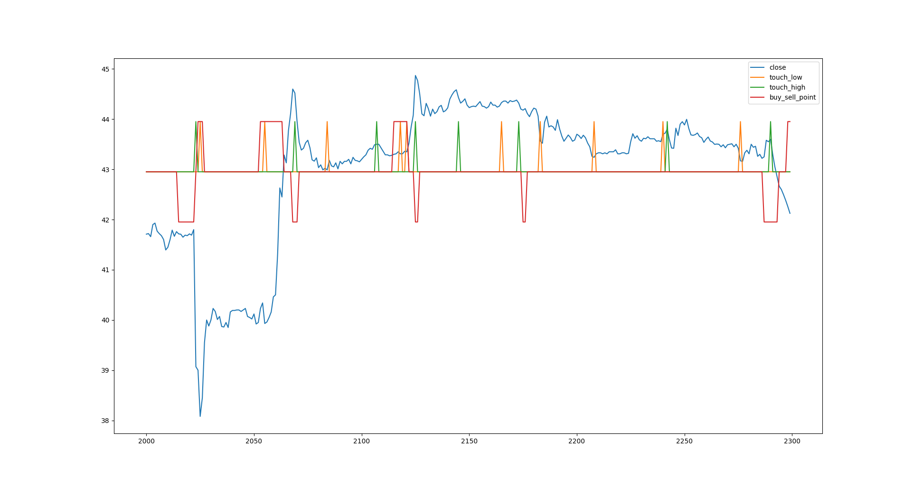
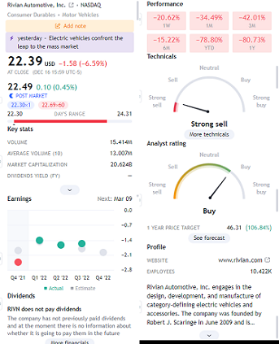
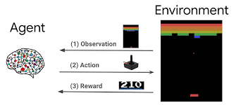
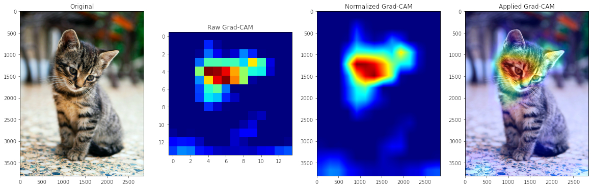
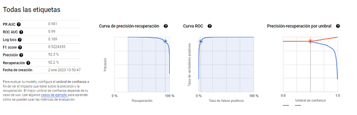
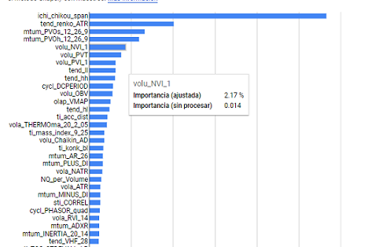
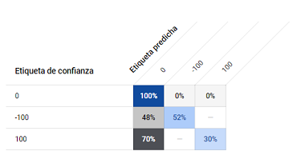
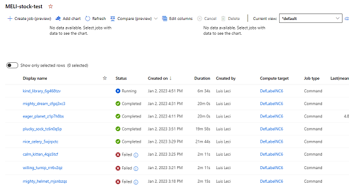
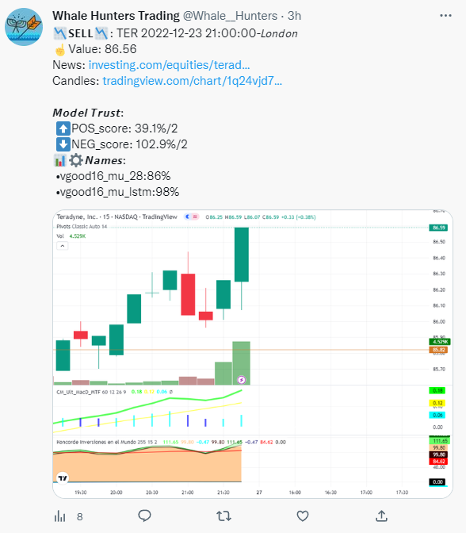
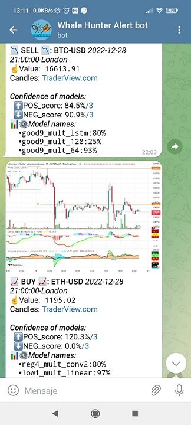

If you have problems with installation, let me know. 
I am searching _**collaborators for this project**_. If you have experience and want to collaborate **We are currently developing privately, if you want to join the team please contact us. https://www.linkedin.com/in/luislcastillo/**

 _**SEE ALSO**_ [Machine Learning Strategy](https://github.com/Leci37/Strategy-stock-Random-Forest-ML-sklearn-TraderView/tree/main)        

### Why this stock prediction project ?
Things this project **offers** that I did not find in other free projects, are:

+ Testing with _**36 models**_. Multiple combinations features and multiple selections of models, easily expandable (TensorFlow , XGBoost, Sklearn, LSTM, GRU, dense, LINEAR etc  )
+ Threshold and quality _**models evaluation**_
+ Use _**637**_ technical stocks indicators
+ Independent neural network selection of the best technical patterns for each stock
+ Response _**categorical target**_ (do buy, do sell and do nothing) simple and dynamic,  instead of poor and confused, continuous target variable ("the stock will be worth 32.4 in 2 days")
+ Powerful open-market-_**real-time**_ evaluation system 
+ Versatile integration with: Twitter, Telegram and Mail
+ Train Machine Learning model with _**Fresh today stock data**_ 

The project is long and dense, trying to install it without understanding is a mistake, the first thing to do is to run and understand the **[TUTORIAL](#tutorial)**,


To manage collaborations we have a  **Telegram GROUP:** 
https://t.me/+3oG6U_hp93I2M2Ix (Once executed and understood the tutorial)
 (recommended to review the point: https://github.com/Leci37/stocks-prediction-Machine-learning-RealTime-telegram/edit/master/README.md#possible-improvements). 

**Strategy models** with Randon Forest, simpler [Randon Forest](https://github.com/Leci37/Strategy-stock-Random-Forest-ML-sklearn-TraderView)

---
  * [Why this stock prediction project ?](#why-this-stock-prediction-project--)
    + [AUTHOR'S LICENSE:](#author-s-license-)
- [**TUTORIAL**](#tutorial)
      - [IMPORTANT: Once executed and understood, join the community to avoid repeating work or try out useless developments already done.](#important--once-executed-and-understood--join-the-community-to-avoid-repeating-work-or-try-out-useless-developments-already-done)
  * [INTRODUCTION](#introduction)
    + [Self-fulfilling prophecy principle](#self-fulfilling-prophecy-principle)
    + [Ground True is the variable `buy_seel_point`](#ground-true-is-the-variable--buy-seel-point-)
  * [Quick start-up Run your own models](#quick-start-up-run-your-own-models)
- [**Detailed start-up**](#detailed-start-up)
    + [1 Historical data collection](#1-historical-data-collection)
      - [**1.0** (Recommended) alphavantage API](#--10----recommended--alphavantage-api)
      - [**1.1** The OHLCV history of the stock must be generated.](#--11---the-ohlcv-history-of-the-stock-must-be-generated)
    + [2 Filtering technical indicators (automatically by default)](#2-filtering-technical-indicators--automatically-by-default-)
    + [3 Training TensorFlow XGB and Sklearn](#3-trian-tensorflow-xgb-and-sklearn)
    + [4 Evaluate quality of predictive models](#4-evaluate-quality-of-predictive-models)
    + [5 Predictions](#5-predictions)
      - [**5.0** make predictions of the last week Optional Test](#--50---make-predictions-of-the-last-week-optional-test)
      - [**5.1** Getting OHLCV data in real time](#--51---getting-ohlcv-data-in-real-time)
      - [**5.2** Setting up chatIDs and tokens in Telegram](#--52---setting-up-chatids-and-tokens-in-telegram)
      - [**5.3** Sending real-time alerts Telegram](#--53---sending-real-time-alerts-telegram)
- [**Possible improvements:**](#--possible-improvements---)
      - [Combine the power of the 17 models](#combine-the-power-of-the-17-models)
      - [Better use tuners](#better-use-tuners)
      - [Real-time alert with .png financial data](#real-time-alert-with-png-financial-data)
      - [Improvements in predictive models using multi-dimensional](#improvements-in-predictive-models-using-multi-dimensional)
      - [Review the way ground true is obtained](#review-the-way-ground-true-is-obtained)
      - [For unbalanced classes, you should look at the F1-score](#for-unbalanced-classes--you-should-look-at-the-f1-score)
      - [Review the free code winners of KAGGLE](#review-the-free-code-winners-of-kaggle)
      - [Are 3 GrounsTrue detection tags sufficient or are subclasses required?](#are-3-grounstrue-detection-tags-sufficient-or-are-subclasses-required-)
      - [Remove columns that have more than 0.9 correlation between them](#remove-columns-that-have-more-than-09-correlation-between-them)
      - [Architecture to Reinforcement Learning](#architecture-to-reinforcement-learning)
      - [MonoLabel vs MultiLabel](#monolabel-vs-multilabel)
      - [Show TF heat map of the detected decison](#show-tf-heat-map-of-the-detected-decison)
      - [Use benefit evaluation function instead of Y target](#use-benefit-evaluation-function-instead-of-y-target)
      - [Imagine the operating points (generative adversarial networks)](#imagine-the-operating-points--generative-adversarial-networks-)
      - [Testing the MachineLearning platforms of large IT companies](#testing-the-machinelearning-platforms-of-large-it-companies)
      - [Add news sentiment indicator](#add-news-sentiment-indicator)
      - [Add balance sheets](#add-balance-sheets)
      - [**Recommended reading LSTM plus stock price FAIL**](#recommended-reading-lstm-plus-stock-price-fail)
      - [Review of all forms of time series prediction: lstm,gru,cnn and rnn](#review-of-all-forms-of-time-series-prediction--lstm-gru-cnn-and-rnn)
      - [Lighter improvements list of suggested](#lighter-improvements-list-of-suggested)
  * [**Instructions for final user**](#instructions-for-final-user)
      - [The alert consists of the following:](#the-alert-consists-of-the-following-)
        * [Example of how the alerts looks like in **Twitter**:](#example-of-how-the-alerts-looks-like-in---twitter---)
        * [Example of how the alerts looks like in **Telegram**:](#example-of-how-the-alerts-looks-like-in---telegram---)
  * [Program Description {OLD}](#program-description--old-)
    + [USE THE SOFTWARE AT YOUR OWN RISK THE AUTHORS AND ALL AFFILIATES ASSUME NO RESPONSIBILITY FOR YOUR TRADING RESULTS](#use-the-software-at-your-own-risk-the-authors-and-all-affiliates-assume-no-responsibility-for-your-trading-results)
    + [Technical Patterns all Names](#technical-patterns-all-names)

<small><i><a href='http://ecotrust-canada.github.io/markdown-toc/'>Table of contents generated with markdown-toc</a></i></small>

[](https://www.buymeacoffee.com/leci37)

#### AUTHOR'S LICENSE:
This project is a very _**long mountain of work free**_, it is given to the public on _**one condition**_, if you make any major improvement, let me know via public or private (leciluis@gmail.com), [the improvement will not be made public if you do not want it]. 

Any other kind of contact with us, please go to the ISSUES tab.  

#### author's note IMPORTANT:
Before assembling everything check the tutorial code, **the predictive models require improvement** without cheating. (95% of the predictive code is in the tutorial). 
The stock market does not only work with technical patterns, you need to know more about the inner workings.  Important to review the article: [My neural network does not improve](https://www.linkedin.com/pulse/my-neural-network-does-improve-through-classical-means-luis-leci%25C3%25B1ana-hsj0f)

## TUTORIAL

The project is long and dense, _**trying to install it without understanding it is a mistake**_, the first thing to do is to run and understand the tutorial file, located in `Tutorial/RUN_buy_sell_Tutorial_3W_5min_RT.py`
it will show in a summarized way the global steps of the project [RUN_buy_sell_Tutorial_3W_5min_RT](https://github.com/Leci37/stocks-prediction-Machine-learning-RealTime-telegram/blob/master/Tutorial/RUN_buy_sell_Tutorial_3W_5min_RT.py)
 :
1. [1] Reading OLHCV data
1. [2] Extraction of all technical patterns 
1. [3] Calculation of the grount true, the Y_target to detect in real time (where to _do nothing_, _do buy_ or _do sell_)
1. [4] Remove unhelpful or noisy technical patterns
1. [5] Normalise the data, for correct training the values must be normalised to between 0 and 1
1. [6] Create '_windows_' of time, for a Y_target prediction use +-4 hours later of technical patterns, not just the current value of the patterns 
1. [7] Splitting between training data and evaluation data 
1. [8] Ground True Y_target data are unbalanced Given that there is a lot of 'do nothing' 0, and very little 'do buy' 1 or 'do sell' 2," weight balancing is required, to give more importance to the minorities.
1. [9] Creation of the TF model architecture 
1. [10] Start the TF training and save it
1. [11] Evaluating the quality of the model 

_**Note:**_ inside the file `Tutorial/RUN_buy_sell_Tutorial_3W_5min_RT.py` , it is very important to understand the author's experience inside **print()** and **#TIP** comments. 
[RUN_buy_sell_Tutorial_3W_5min_RT](https://github.com/Leci37/stocks-prediction-Machine-learning-RealTime-telegram/blob/master/Tutorial/RUN_buy_sell_Tutorial_3W_5min_RT.py)

Points: _2,3,4,9,10_ and _11_ **_should be refined and improved_**.    For more details about improvements there is point [**Possible improvements:**](#combine-the-power-of-the-17-models) .

##### IMPORTANT: Once executed and understood, join the community to avoid repeating work or try out useless developments already done.  
_**Telegram GROUP:**_ https://t.me/+3oG6U_hp93I2M2Ix  

### INTRODUCTION
The stock market is moved by technical indicators, there are several types of volatility, cycle volume, candlesticks, supports, resistances, moving averages...

An excellent site to see all the stock market technical indicators is webull https://app.webull.com/trade?source=seo-google-home. 

Image: webull with Stochastic, MACD and RSI indicators


On the stock market graphs have been invented EVERY possible way to predict the stock market, with mixed results, making clear the difficulty of predicting human behavior.

These indicators indicate where to buy and sell, there are many beliefs about them (we mean in beliefs, because if they always worked we would all be rich). 

Any technical indicator can be obtained by means of programmable mathematical operations.

Three examples:

**RSI** or Relative Strength Index is an oscillator that reflects relative strength

Greater than 70 overbought, indicates that it will go down.

Less than 70 oversold, indicates that it will go higher 

**MACD** is the acronym for Moving Average Convergence / Divergence. The MACD in the stock market is used to measure the robustness of the price movement. Through the crossing of the line of this indicator and the moving average

It operates on the basis of the crossovers between these two lines

Or it is operated when both exceed zero.

**Candlestick: Morning Star** The morning star pattern is considered a hopeful sign in a bearish market trend.


These indicators are present in refuted and popular websites like investing.com to be analyzed by the market <https://es.investing.com/equities/apple-computer-inc-technical>

###### How do I know when the WHALE touches the button, and breaks the model? 
In the video you can see the whales manipulating the price, does anyone think they can predict when the madman in the City of London hits the button? It is recommended to understand that there are NOT VISIBLE data, and if they are not visible TF can not do miracles (TV and politicians say that AI does miracles, what it does is massive statistics with data).  If you don't understand this I think you should go to other projects. It is recommended to avoid this code in intervals less than 1 hour. 

**See the news** _A “fat-finger error” by a [London-based trader at Citigroup that triggered a flash crash](https://www.theguardian.com/business/2022/jun/03/flash-crash-set-off-by-fat-fingered-citigroup-trader-could-cost-50m) across European stock markets could cost the bank at least $50m (£39.8m)._
**See video** [Chinese Whales Dumping Bitcoin](https://www.youtube.com/watch?v=pkgTAEsOWnA) or [alternative](https://www.youtube.com/shorts/IpIyo4YmfuY?app=desktop) .
I ask the reader at this point, **how is this predicted?** _I don't have the testosterone data of the London Kids XD ._ 😄😄

#### Self-fulfilling prophecy principle

It is extremely difficult to predict the price of any stock. Inflation, wars, populism, all this conditions affect the economy, and it becomes difficult, if not impossible to predict what Vladimir Putin will do tomorrow. 

Here enters the self-fulfilling prophecy principle of explained is, at first, a "false" definition of the situation, which awakens a new behavior that makes the original false conception of the situation become "true". Example:


#### Ground True is the variable `buy_seel_point` GT
The model to be able to train in detecting points of purchase and sale, creates the column `buy_seel_point` has value of: 0, -100, 100. These are detected according to the maximum changes, (positive 100, negative -100) in the history of the last months, this point will be with which the training is trained, also called the *ground* true. 

Defining the GT (Ground True) is a subjective task, these numbers can be obtained in 2 ways:
 - `Utils_buy_sell_points.get_buy_sell_points_Roll` (default). Value will be assigned in buy_seel_point if the increase or decrease of the stock is greater than 2.5% in a period of 3 hours, using the get_buy_sell_points_Roll function.

 - `Utils_buy_sell_points.get_buy_sell_points_HT_pp` (decomments the line) Inspired by the TraderView technical indicator "Pilots HL".
 - For change the config to **1-day candlesticks** (with frequent daily changes of +-1% defined in the variable `PER_VALEU_CHANGE = 1`). You can see it in the method `get_GT_day_candle(df_kon)` and extra `rolling_buy_sell_val_BUY(df_ind)`it is strongly recommended to use this other function to obtain the GT, [file candlesticks GT day](https://github.com/Leci37/Strategy-stock-Random-Forest-ML-sklearn-TraderView/blob/main/technical_parameters_konk_tools_Prepro.py) 

On the graphic, you can see the difference being:
**_Blue_** the candle Close
_**Red**_ the values obtained in `get_buy_sell_points_Roll()` the positive and negative peaks indicate sell and buy points.
The points obtained in `get_buy_sell_points_HT_pp()` are shown, the **_Orange_** peaks being the Buy points and the **_Green_** peaks being the Sell points.



### Quick start-up Run your own models

 
Install requirements (to know the exact version `Utils/requirements_x.y.z.txt`)
```
pip install -r requirements.txt
```
By default (recommendation) the stock list will be used: `"@CHILL": ["UBER", "PYPL"]`

Run `0_API_alphavantage_get_old_history.py` Optional. File generate example:  `d_price/RAW_alpha/alpha_UBER_15min_20230414__20230317.csv`
Run BETTER get **alpaca API** key and  `0_API_alpaca_historical.py` 

Run `1_Get_technical_indicators.py` Files generate example: `d_price/PYPL_PLAIN_stock_history_MONTH_3_AD.csv` and `plots_relations/best_selection_PYPL_both.json`

Run `3_Model_creation_models_for_a_stock.py` Files generate example models TF .h5: `Models/TF_multi/TFm_UBER_neg_vgood16_mult_lstm.h5` , `Models/TF_multi/UBER_neg_vgood16__per_score.csv` and `Models/TF_multi/Scalers/UBER_neg_good9_.scal`

Run `4_Model_creation_scoring_multi.py` Optional, evaluation the models predictions File generate:  `Models/TF_multi/_SCORE_ALL_multi_all.csv`

**Having reached this point**, We would like to get to know you (this is a project of 11 months of work) and I would like you to tell me in Issues tab or Discussion tab what you think and if you see any utility in https://github.com/Leci37/stocks-prediction-Machine-learning-RealTime-telegram#possible-improvements. 
At this point the **file** `realtime_model_POOL_driver.py` **is required**, you must **ask for it** . 


Real-time forecasts:

Run `Utils/Volume_WeBull_get_tikcers.py` Ignore in case of using default configuration 

Configure bot token see point 5**.2** Configuring chatID and tokens in Telegram

Run `5_predict_POOL_enque_Thread.py`

It is possible to run it without configuring telegram point **5.2**, in that case no alerts will be sent in telegram, but if the results were recorded in real time in: *d_result/prediction_real_time.csv*

## Detailed start-up
Models with better accuracy are in _**Tutorial/RUN_5_models_0.61_accuracy.py**_

To do step 0, **installation or correct errors** in the installation there are also  [Step by step](Readme_setup_installation.md)

(Running times are estimated for an intel i3 and 8GB of RAM)


**0.0**The interpreter with which the tutorial has been made is python 3.8 , IDE Pycharm, caution with the compatibility between versions of the library pandas and python
For example: today do not use python 3.10 , as it is incompatible with pandas https://stackoverflow.com/questions/69586701/unable-to-install-pandas-for-python 


**0.1** Download and install requirements, the project is powerful and demanding in terms of libraries.

pip install -r requirements.txt 
(to know the exact version `Utils/requirements_x.y.z.txt`)

**0.2** Search all files for the string `**DOCU**`

this allows to watch all files that are executable from the startup tutorial easily 

**0.3** In the file `_KEYS_DICT.py` all the configurations are stored, look at the document and know where it is.

In it there is the dictionary DICT_COMPANYS

It contains the IDs (GameStops quotes with the ID: **GME**) of the companies to analyze. You can customize and create a class from the **nasdaq** tikers, by default the key **@CHILL** will be used which will analyze these 2 companies.
```python 
 "@CHILL": ["UBER", "PYPL"],
```
If more stock execution is desired, change to @FOLO3 o similar in file `_KEYS_DICT.py`

#### 1 Historical data collection
##### **1.0** (Recommended) alphavantage API
` `The API yfinance , if you want price to price intervals in 15min intervals is limited to 2 months, to get more time data up to 2 years back (more data better predictive models) use the free version of the API https://www.alphavantage.co/documentation/  

Run `0_API_alphavantage_get_old_history.py`

Run BETTER get **alpaca API** key and  `0_API_alpaca_historical.py` 

The class is customizable: action intervals, months to ask, and ID action.

Note: being the free version, there is a portrait between request and request, to get a single 2 years history it takes 2-3 minutes per action. 

Once executed, the folder: *d_price/RAW_alpha* will be filled with **_2 years extra_** historical OHLCV .csv of share prices. These files will be read in the next step. Example path name: `d_price/RAW_alpha/alpha_UBER_15min_20230414__20230317.csv`

Check that one has been generated for each action in *d_price/RAW_alpha*.


##### **1.1** The OHLCV history of the stock must be generated.
As well as the history of technical patterns. It takes +-1 minute per share to calculate all technical patterns. 

Run `1_Get_technical_indicators.py`

**ALL technical indicators** in python you can find here, look the funtion extract_features(df: pd.DataFrame,extra_columns =False,  shift=150, debug=False) inside https://github.com/Leci37/TensorFlow-stocks-prediction-Machine-learning-RealTime/blob/master/features_W3_old/v3.py some of the technical indicators take future data, be careful.

Once executed the folder: *d_price* will be filled with historical OHLCV .csv of share prices.

Three types of files are generated (Example of name type for action: AMD):

- *AMD_SCALA_stock_stock_history_MONTH_3_AD.csv* with all technical patterns calculated and applied a fit scaler(-100, 100), i.e. the stock prices are scaled (size: 30-90mb)
- *d_price/min_max/AMD_min_max_stock_MONTH_3_AD.csv* with scaling keys (size: 2-7kb)
- *AMD_stock_history_MONTH_3_AD.csv* the pure history of the OHLCVs (size: 2-7mb)

Note: *MONTH_3_AD* means 3 months of *API* yfinance plus the history collected from alphavantage. Point 1.0

Check that one has been generated for each action.


#### 2 Filtering technical indicators (automatically by default)
This step is done automatically and the variable `GENERATED_JSON_RELATIONS` (in `get_technical_indicators.py`)  is set to True (default True). 
It is necessary to separate the technical indicators which are related to buy or sell points and which are noise. 20 seconds per share 

Run `Feature_selection_create_json.py` (**uncommnet** `for l in list_stocks:` )

Three files are generated for each action in the folder: *plots_relations* , relations for purchase "pos", relations for sale "neg" and relations for both "both".

- *plots_relations/best_selection_AMD_both.json*

These files contain a ranking of which technical indicator is best for each stock. 

Check that three .json have been generated for each action in *plots_relations* .

#### 3 Trian TensorFlow XGB and Sklearn  
Train the models, for each action 36 different models are trained.
15 minutes per share.

Run `3_Model_creation_models_for_a_stock.py`  *Requires Declaration.py, request it* https://github.com/Leci37

The following files are generated for each action:

~~*Models/Sklearn_smote* folder:~~ _[OBSOLETE]_

- XGboost_AMD_yyy_xxx_.sav
- RandomForest_AMD_yyy_xxx_.sav
- XGboost_AMD_yyy_xxx_.sav

~~*Models/TF_balance* folder:~~ _[OBSOLETE]_

- TF_AMD_yyy_xxx_zzz.h5
- TF_AMD_yyy_xxx_zzz.h5_accuracy_71.08%__loss_0.59__epochs_10[160].csv

*Models/TF_multi* folder: 

- TFm_AMD_yyy_xxx_zzz.h5  
  - Purely saved TF model
- TFm_AMD_yyy_xxx_zzz.h5_accuracy_71.08%__loss_0.59__epochs_10[160].csv 
  - Training statistics lost, accuracy against unseen data "Validation", against unseen data "Test" and information , against seen data "Test" and information of input columns
- Scalers/AMD_yyy_xxx_.scal
  - TF can only be entered with values from 0 to 1, the object containing the scaling patterns is saved in .scal format, it will be very useful in real time reading. 

xxx can take value vgood16 good9 reg4 and low1 

yyy can take value "pos" and "neg".

zzz can take value s28 s64 and s128

Check that all combinations of files exposed by each action have been generated in the /Models subfolders.


#### 4 Evaluate quality of predictive models 
From the 36 models created for each OHLCV history of each stock, only the best ones will be run in real time, in order to select and evaluate those best ones.

Run `4_Model_creation_scoring_multi.py`
You can see how around 36 TF .h5 models are generated per action, you have to evaluate the 36 and collect the 1-3 best models to use them in real time, this information will be dumped in the files:
- Models/TF_multi/_RESULTS_profit_multi_all.csv
- Models/TF_multi/_SCORE_ALL_multi_all.csv

Check that two have been generated for each action.

**Having reached this point**, We would like to get to know you (this is a project of 11 months of work) and I would like you to tell me in Issues tab or Discussion tab what you think and if you see any utility in https://github.com/Leci37/stocks-prediction-Machine-learning-RealTime-telegram#possible-improvements. 

#### 5 Predictions
##### **5.0** make predictions of the last week Optional Test 
Run `Model_predictions_Nrows.py`

At this point the **file** `realtime_model_POOL_driver.py` **is required**, you must **ask for it** 

This run generates the log file *d_result/prediction_results_N_rows.csv*
Generates a sample file with predictions for the last week, data obtained with yfinance. 
Check that records exist 


##### **5.1** Getting OHLCV data in real time
In case you want to predict actions in the @FOLO3 list, ignore this point. 

It is difficult to get real time OHLCV, especially volume (yfinance gives real time volume, but this is not a correct value and after 1-2 hours it changes, making it unfeasible to use yfinance for real time predictions).

To get correct volumes in real time, queries are made to webull, for each stock every 2.5 minutes, a webull ID is required, the default ones @FOLO3 are cached and downloaded in *a_manage_stocks_dict.py. DICT_WEBULL_ID*

But if you want to use actions outside the list @FOLO3 

In Utils/Volume_WeBull_get_tikcers.py

Change the example list:
```
list_stocks = ["NEWS", "STOCKS", "WEBULL", "IDs"]
```
By the nasdaq ticker, of the webull ID you want to get.

Run Utils/Volume_WeBull_get_tikcers.py

Once executed it will show a list on screen, that must be added in *a_manage_stocks_dict.py.DICT_WEBULL_ID*
```
"MELI" : 913323000,
"TWLO" : 913254000,
```

##### **5.2** Setting up chatIDs and tokens in Telegram
You have to get the telegram token and create a channel. 

You can get the token by following the tutorial: [https:](https://www.siteguarding.com/en/how-to-get-telegram-bot-api-token)//www.siteguarding.com/en/how-to-get-telegram-bot-api-token 

With the token update the variable of ztelegram_send_message_handle.py
``` python
#Get from telegram
TOKEN = **"00000000xxxxxxx"**
```
Once the token has been obtained, the chatId of the users and administrator must be obtained. 

Users only receive purchase and startup sale alerts, while the administrator receives alerts from users as well as possible problems.

To get the chatId of each user run ztelegram_send_message_UptateUser.py and then write any message to the bot, the chadID appears both in the console and in the user's chadID 
```
*[>>> BOT] Message Send on 2022-11-08 22:30:31:31*
`	`*Text: You "User nickname " send me:* 
*"Hello world"*
` `*ChatId: "5058733760".*
`	`*From: Bot name*
`	`*Message ID: 915*
`	`*CHAT ID: 500000760*
*-----------------------------------------------*
Pick up *CHAT ID: 500000760*
```
With the chatId of the desired users, add them to the LIST_PEOPLE_IDS_CHAT list.

in ztelegram_send_message_handle.py


##### **5.3** Sending real-time alerts Telegram
It is possible to run it without configuring telegram, in that case no alerts will be sent in telegram, but the results will be recorded in real time in: *d_result/prediction_real_time.csv*

It will be reported in console via: 

`is_token_telegram_configurated()` - Results will be recorded in real time, but no alert will be sent on telegram. File: *d_result/prediction_real_time.csv*

`is_token_telegram_configurated()` - There is no value for the telegram TOKEN, telegram is required to telegram one*

The criteria to send alert or not is defined in the method ztelegram_send_message.will_send_alert(). If more than half of the models have a score greater than 93% or the TF models have a score greater than 93%, an alert is sent to the consumer users. 

Run `5_predict_POOL_enque_Thread.py`

In this class there are 2 types of threads 

- Producer , constantly asks for OHLCV data, once it is obtained, it enters it into a queue. 
- Consumer (2 threads running simultaneously) are pulling OHLCV data from the queue, calculating technical parameters, making model predictions, registering them in zTelegram_Registers.csv, and if they meet the requirements they are sent by telegram. 

[](https://www.buymeacoffee.com/leci37)


## **Possible improvements:**
##### Combine the power of the 17 models
would be to combine the power of the 17 models tested at  https://github.com/huseinzol05/Stock-Prediction-Models predictive models with https://github.com/Leci37/stocks-Machine-learning-RealTime-telegram/tree/develop real-time pattern calculation and alerting capabilities.
Should be implemented in the method `train_model_with_custom_columns(name_model, columns_list, csv_file_SCALA, op_buy_sell : a_manage_stocks_dict.Op_buy_sell):`
For multidimension branch: `get_dicts_models_multi_dimension(self). `

another interesting improvement is the addition of PYTORCH, is the tensor flow "competence". 

##### Better use tuners
Even if the testing of the 17 models improves the result , the ML libraries, offer **_"tuners"_**, tools that test all desired combinations and turn the ideal configuration for that data. For tensor flow, see https://www.tensorflow.org/tutorials/keras/keras_tuner 
In the project there are several intents of use: `Model_finetune_TF.py`, `Model_finetune_TF_2.py` and `Model_finetune_XGB.py`. 
Running the "tuners" code is very heavy on the computer. 
You can add more models (the 17 for example) and tune them with keras_tuner.
Example of the multiple values that keras_tuner allows: 
``` python
neurons = [2, 4,8,16,24,28,32,32,44,52,64,92,92]]
weight_constraint = [1.0, 3.0, 4.0, 5.0, 7.0]
dropout_rate = [0.0, 0.1, 0.2, 0.2, 0.3, 0.4, 0.5, 0.6, 0.7, 0.8, 0.9]
hp_learning_rate = hp.Choice('learning_rate', values=[1e-2, 1e-3, 1e-4, 1e-5])
param_grid = dict(model__dropout_rate=dropout_rate, model__weight_constraint=weight_constraint, model__neurons=neurons).
model = KerasClassifier(model=create_model_2, epochs=100, batch_size=10, verbose=2)
```
More information:
https://www.simplilearn.com/tutorials/deep-learning-tutorial/keras-tuner and 
https://machinelearningmastery.com/grid-search-hyperparameters-deep-learning-models-python-keras/

##### Real-time alert with .png financial data

You can add to the alerts the summary of the financial information from TraderView.com, this image will always be loaded with the financial-analyst information in real time.  
Image is generated by code `__create_find_data_png_trader_view(path_png + "_TRAVIEW_finan.png")`

Example of summary:




##### Improvements in predictive models using multi-dimensional 
**Solved**  _Note 29-December 2022_  in _stocks-prediction-multi_ branch (ask for it without any problem).
Improvements in TF predictive models using tensors (multiple matrices over time) and non-matrices (mono temporal, current design). 

In the class `Model_TF_definitions.ModelDefinition.py`

Through it, the model configurations, density, number of neurons, etc. are obtained.

There are two methods:

- `get_dicts_models_One_dimension()` is currently used and generates TF model configurations for arrays. 
- `get_dicts_models_multi_dimension()` is not in use, it is set to give multiple model configurations using tensors. 

There is the `Utils.Utils_model_predict.df_to_df_multidimension_array(dataframe, BACHT_SIZE_LOOKBACK)` method, which transforms 2-dimensional df [columns , rows] to 3-dimensional df [columns , files, BACHT_SIZE_LOOKBACK ].

BACHT_SIZE_LOOKBACK means how many records in the past tense are added to the df, the number is configurable and default value is eight.

To start the development must be to call the method with BACHT_SIZE_LOOKBACK with an integer value, the method will return a multidimensional df [columns, files, BACHT_SIZE_LOOKBACK ], with which to feed the TF models.

Utils_model_predict.scaler_split_TF_onbalance(df, label_name=Y_TARGET, BACHT_SIZE_LOOKBACK=8)


**Improvement**: Once these multidimensional arrays are returned, models are obtained with `get_dicts_models_multi_dimension()`, it is not possible to train a model and make a prediction with multidimensional arrays. 

##### Review the way ground true is obtained 
It is recommended to review the point "Ground True is the variable" of the documentation, to understand this point.

Before training the models the intervals (of 15min) are classified as buy point 100 or 101, sell point -100 or .-101 or no trade point 0, these values are entered in the column Y_TARGET = **'buy_sell_point'** through the method `Utils.Utils_buy_sell_points.get_buy_sell_points_Roll()`.  

The variation is calculated with respect to the following 12 windows (15min \* 12 = 3 hours), and from there the 8% points of greatest rise and greatest fall are obtained, and these points are assigned values other than 0.

To obtain the Y_TARGET there are 2 methods that are responsible for the strategy to follow once you buy and sell, in case of loss will opt for Stop Loss.

`rolling_get_sell_price_POS()` and `rolling_get_sell_price_NEG()`

**Optional improvement**: the current system decides by percentages, i.e. the 16% highest rises and falls (8% each) are ground true. I.e. there are rises or falls greater than 3% that can be left out if the stock is very volatile.

##### For unbalanced classes, you should look at the F1-score
For unbalanced classes, you should look at the f1-score indicator https://datascience.stackexchange.com/questions/105089/how-f1-score-is-good-with-unbalanced-dataset  
What we are trying to achieve with the F1-score metric is to find an equal balance between precision and recall, which is extremely useful in most scenarios when we are working with imbalanced datasets (i.e., a dataset with a non-uniform distribution of class labels). 
A model with high recall but low precision score returns many positive results, but most of its predicted labels are incorrect when compared to the ground truth.
On the other hand, a model with high precision but low recall score returns very few results, but most of its predicted labels are correct when compared to the ground-truth. 
An ideal scenario would be a model with high precision and high recall, meaning it will return many results, with all results labelled correctly. Unfortunately, in most cases, precision and recall are often in tension. 

#####  Review the free code winners of KAGGLE 
Review the free code of people who have been in the top10 winners of kaggle, the championship models teach a lot.
At the moment I'm inspired by the 3rd place of the "price of the house in paris", it's data from .csv and unbalanced https://www.kaggle.com/code/viktortaran/ps-s-3-e-6?scriptVersionId=119565159&cellId=129  
( it's hard to find them most of the winners in kaggle don't publish in open) 
For more CHAMPIONSHIP notebooks:
https://ndres.me/kaggle-past-solutions/  
https://www.kaggle.com/code/sudalairajkumar/winning-solutions-of-kaggle-competitions 

##### Are 3 GrounsTrue detection tags sufficient or are subclasses required? 
How do you know that GrounsTrue **clustering** (_buy, sell, nothing_) is similar and correct? Is it necessary to cluster with **more labels** (_buy_A, sell_A , nothing_A, buy_B, sell_B , nothing_B, buy_C, sell_C_)? How do I know the number of tags needed ?
To solve this question you can use the "K-means Clustering" https://neptune.ai/blog/clustering-algorithms


##### Remove columns that have more than 0.9 correlation between them
Remove columns that have more than 0.9 correlation between them, as they **are redundant**. Inside the method 
```python 
uncorrelate_selection(features_X_ALL, num_features=NUMS_FEATURES, split_ratio=SPLIT_RATIO_X_Y, column_path=f'data/columns_select/{symbol}_{REF_MODEL}.pkl')
    # Look for the next line and try the correction 
    # Get the correlation table
    corr = train_data.corr()
```
More info help: https://machinelearningmastery.com/basic-data-cleaning-for-machine-learning/ 


##### Architecture to Reinforcement Learning
Another way to get a rebuild of the GT, is to change the architecture to Reinforcement Learning RL, which has the feature of not using GT, **it learns after many trial and error attempts**.
There are three types of trades buy, sell or hold. the RL randomly tests them, collects results, and learns from the failures, when it is correct to buy, sell or hold.



The main project that uses RL is https://github.com/AI4Finance-Foundation/FinRL.
Especially the tutorial to make RL with OHLCV data and 2 technical patterns. https://github.com/AI4Finance-Foundation/FinRL/blob/master/examples/Stock_NeurIPS2018_SB3.ipynb 

That project does not have good tools for real time data collection, alert system, it also works with daily OHLCV data (instead of the intra day 5min, 15min, 1h of this project), which leaves you very exposed to news and financial results. 

To start getting familiar with this POWERFUL tool, we recommend the following tools and tutorials
- From 0 : https://gymnasium.farama.org/tutorials/training_agents/blackjack_tutorial/ 
- Beginner: https://github.com/AminHP/gym-anytrading 
- Intermediate-advanced: https://github.com/AminHP/gym-mtsim 
- Professional: https://github.com/AI4Finance-Foundation/FinRL

##### MonoLabel vs MultiLabel
The models are binary, i.e., some POS models are generated to detect only points of purchase and other NEG to detect only points of sale, these predictive models only detect True or False.

  You can try to add a multi-label detection, this would translate into Buy, Sell, Nothing preconditions. 
Hint: look for ` activation='sigmoid'` and implement https://stackoverflow.com/questions/55936546/binary-and-multi-class-classification-code-change 

#####  Show TF heat map of the detected decison 
When making TF image predictions, it provides the **_heat map_**, i.e., what pixels it looked at to make the decision.
Which of the technical patterns provided (in 3d array format)? 
forming the heat map, of the given preconditions 
Example for TF cat detection:



Search for better correlations strength  https://gmarti.gitlab.io/ml/2019/10/13/tf-dcgan-financial-correlation-matrices.html 

##### Use benefit evaluation function instead of Y target
Instead of using the ground true, i.e. the objective "y", it can be disguised, i.e. at each step of the training it is not evaluated against the "y" but against the function "benefit obtained" (which would have to be created). 
For this it is necessary to create callback decorators in the training function like https://www.tensorflow.org/guide/keras/customizing_what_happens_in_fit?hl=es-419#wrapping_up_an_end-to-end_gan_example 


##### Imagine the operating points (generative adversarial networks) 

This is the strangest improvement, and the one that makes me **_most curious_**

Tensor Flow allows to create fictitious images by means of the system of **_two neural networks fighting_** (one neural network "artist" and the other "critic"). The artist creates small modifications and the critic tells him to go closer or farther away. 
This tactic is called **_GAN (generative adversarial networks)_**
https://www.tensorflow.org/tutorials/generative/dcgan [ Example of real time creation of fictional anime GAN images](https://github.com/BaoLocPham/TensorFlow-Advanced-Techniques-Specialization/blob/main/MOOC%204%20-%20Generative%20Deep%20Learning%20with%20TensorFlow/week%203%20-%20Variational%20Auto%20Encoder/vea-anime-anim.gif )
 


The multidimensional training data of the _stocks-prediction-multi_  branch, are 3d arrays (a .png .jpg ... is also a 3d array), with that data you can create the fight between "artist" and "critic". 
This totally changes the way of preceding, 
 currently you collect data and ask the TF model, is it a point of buying and selling? 
With this change, it works like:
1. TF model receives a request "generate-imagine" buying points
1. TFmodel returns **_many fictional_** arrays3d
1. when in real time appears an array3d similar to the imagined one, the buy-sell alert is launched.


##### Testing the MachineLearning platforms of large IT companies 

Once you have obtained the history (example named _GOOG_PLAIN_stock_history_MONTH_3.csv_) with the technical patterns of the stock you can try using the prediction services of the big IT companies:  
1. Google: https://cloud.google.com/vertex-ai/docs/beginner/beginners-guide 
2. Microsotf Azure: https://learn.microsoft.com/es-es/azure/machine-learning/how-to-use-automated-ml-for-ml-models
3. AWS: https://aws.amazon.com/es/getting-started/hands-on/machine-learning-tutorial-automatically-create-models/ 

_**Usage experience:**_
Dic-2022 (Azure and Google allow you to export locally from model and make predictions locally without relying on the clouds, AWS for the moment forces you to make predictions in their cloud, making the cost of maintenance much more expensive (I have not tested AWS in depth for that reason).
Azure takes a lot of time (more than 15h)  tests many more models, many fail and you have to pay for the time it takes to fail. 
`ERROR: Unexpected bus error encountered in worker. This might be caused by insufficient shared memory (shm).`

_**Google**_ goes faster, but does not support for the moment any result better than the one obtained locally.


 

Both allow you to easily download the models created, **_Azure_** with .py files for guidance. 



More models, more power Azure, it is also more expensive.


##### Add news sentiment indicator
You get the news for each stock with `news_get_data_NUTS.get_news_sentiment_data()` this method gets all the associated news from: INVESTING.com, YAHOO.com and FINVIZ.COM.

News is obtained from yahoo and finviz.com, (see file https://github.com/Leci37/TensorFlow-stocks-prediction-Machine-learning-RealTime/blob/master/news_sentiment/news_get_data_NUTS.py ) **NO NEWS FROM TWITTER** in this version, just publish result on it.
While news are obtained, the news are not valued by the TensorFlow models as of today. (providers with little and poor data).

( it uses investpy API , which recently october 2022 has started to fail , probably due to investing[.com](https://github.com/alvarobartt/investpy) blocking <https://github.com/alvarobartt/investpy> )

Once these news items are obtained, the method `news_sentiment_va_and_txtBlod.get_sentiment_predictorS()` proceeds to evaluate and score from -100 negative to 100 positive, using 4 models. It is convenient to introduce more news pages

The models are downloaded from the internet, either via AI models or libraries, you can find the references in:
```
news_sentiment_flair.get_sentiment_flair
news_sentiment_t5.get_sentiment_t5
news_sentiment_t5.get_sentiment_t5Be
get_sentiment_textBlod
```
Run `news_get_data_NUTS.get_json_news_sentimet()`

A .csv and .json file is generated, with action date the four models, the score and the news collected Example: *d_sentiment/stock_news_DATE_MELI.csv*


**Improvement**: Once the sentiment-news score file is obtained, introduce it in the predictive models together with the technical indicators, it must be done in real time.


##### Add balance sheets
Economic balances can be added easily using the yahoo API

<https://github.com/ranaroussi/yfinance>

\# show financials
```
msft.financials
msft.quarterly_financials
```
These balances are updated every quarter.

You can get the dates of publication of results in yahoo API

\# show next event (earnings, etc)
```
msft.calendar
```
\# show all earnings dates
```
msft.earnings_dates
```
#####  Recommended reading LSTM plus stock price FAIL
This does not understand the principle of self-fulfilling prophecy (explained at the beginning), but it is worth considering. 
_LSTM time series + stock price prediction = FAIL_ 
[https://www.kaggle.com/code/carlmcbrideellis/lstm-time-series-stock-price-prediction-fail ](https://www.kaggle.com/code/carlmcbrideellis/lstm-time-series-stock-price-prediction-fail)

##### Review of all forms of time series prediction: lstm,gru,cnn and rnn
Laurence Moroney has extensive tutorials in his book on how to correctly make temporary preditions (LSTM; GRU; RNN; CNN; ). https://github.com/lmoroney/tfbook/tree/master/chapter11 

A good google brain tutorial Laurence Moroney  https://github.com/MoRebaie/Sequences-Time-Series-Prediction-in-Tensorflow/blob/master/Course_4_Week_4_Exercise_Question.ipynb 

##### Lighter improvements list of suggested

Allow to analyze stocks outside the nasdaq, change in :

`yhoo_history_stock._select_dowload_time_config()`

Utils/API_alphavantage_get_old_history.py

Redirect remaining `print()` to `Logger.logr.debug()`

Translate through <https://www.deepl.com/> the possible remaining messages in Spanish to English. 

The plots generated in the *plots_relations/plot* folder by 

Change the operation of the bot, that is enough to send the command `\start`, and remove the case of execution of `ztelegram_send_message_UptateUser.py` described in point: 5.2

Send real time email alert

Revise Stock prediction fail LSTM , **Solved** in _stocks-prediction-multi_ branch

Find the explanation of what indicators and values the AI model takes, to predict what it predicts and give a small explanation-schema, for example random forest models if you can print the sequence that makes the prediction. 

(green buy, red do not trade) https://stackoverflow.com/questions/40155128/plot-trees-for-a-random-forest-in-python-with-scikit-learn 


### Instructions for final user
- RealTime Twitter https://twitter.com/Whale__Hunters

- RealTime Telegram @Whale_Hunter_Alertbot this group is limited, to receive alert to sign up  ask via github or twitter 

The models have been trained in **_15 min_** intervals with , i.e. the alerts expire in about 7 minutes, that means that once the tweet goes out, you have +-7 minutes to decide whether to trade or not. also that the models should be used on intra-day trade._Never blindly follow the alerts, check first_. 
The alerts indicate points where **_only technical patterns have brought strong trend changes_** in the last 5 months, i.e. if these models were applied to the last 5 months they would hit 91% of the BUY SELL points, in the future no one can know. 
In other words, it is not an absolute truth.

The alerts are designed **for INTRADAY operations**, for the moment only with technical patterns, that is to say at the end of the day it is recommended to close them, in the future no one can know.

##### The alert consists of the following:
- Can be _**BUY**_ or _**SELL**_.
- The id  of the stock, always from the USA market, in case of crypto will have the termination **_-USD_**. In case of Tesla, it is TSLA, in case of doubt with the company id , a simple google search "_Stocks XXX_".
- Link to _**Investing.com**_ news, check before making the final decision.
- Link to the candlesticks through _**TraderView.com**_, is the image shown attached with the alert. 
- 𝙈𝙤𝙙𝙚𝙡 𝙏𝙧𝙪𝙨𝙩:⬆⬇, level of strength indicating whether there is a positive or negative trend and behind / number of models used to obtain the percentage. 
It may be the case that both the uptrend POS and downtrend NEG have a high score, indicating increased volatility.
- 📊⚙𝙉𝙖𝙢𝙚𝙨:
The name of the selected models with which the prediction has been made and the percentage of strength. 

###### Example of how the alerts looks like in **Twitter**:


###### Example of how the alerts looks like in **Telegram**:



### Program Description {OLD}

**OHLCV** :An opening-high-low-closing-volume chart is a type of chart that is typically used to illustrate movements in the price of a financial instrument over time.

**Functions:**

1. Collection of historical **stocks** OHLCV data for the last years and calculation of technical patterns (momentums, volatility, Japanese candlesticks, statistics...), 1068 patterns.
1. Calculations of which of the 1068 are the most valuable, and most relevant for the detection of good trading points (buy-sell).
1. Training of several machine learning models using powerful libraries:Google Tensor Flow Sklearn and XGB
1. Evaluation of the multiple models, to discard the less reliable ones. 
1. OHLCV data collection and making predictions from the models in real time, when any of the multiple predictions (buy-sell stocks) is considered valid, sending real-time alert to Telegram and Mail. 

_**Remember**_ the scalability of the project, it receives OHLCV data but can _**receive any type of data in .csv or excel**_ for predictions, with few changes (check the structure), it would be nice to complete the development so that it can receive predictions of any type, with open source. I am willing to help. 
The predictive models generated by the solution are **_binary_**, i.e. they detect True or False.

See article in **medium.com** https://medium.com/@LuisCasti33/lectrade-machine-learning-with-technical-patterns-and-real-time-alerts-for-buying-and-selling-in-b4ecc59b29cb


#### USE THE SOFTWARE AT YOUR OWN RISK THE AUTHORS AND ALL AFFILIATES ASSUME NO RESPONSIBILITY FOR YOUR TRADING RESULTS
USE THE SOFTWARE AT YOUR OWN RISK THE AUTHORS AND ALL AFFILIATES ASSUME NO RESPONSIBILITY FOR YOUR TRADING RESULTS. Do not risk money which you are afraid to lose. There might be bugs in the code - this software DOES NOT come with ANY warranty.
Permitted, free use and modification, but no commercialization to third parties, without authorization. All rights reserved. Improvements or changes by third parties must be notified

#### Technical Patterns all Names

**ALL technical indicators** in python you can find here, look the funtion extract_features(df: pd.DataFrame,extra_columns =False,  shift=150, debug=False) inside https://github.com/Leci37/TensorFlow-stocks-prediction-Machine-learning-RealTime/blob/master/features_W3_old/v3.py some of the technical indicators take future data, be careful.

All patterns used 
```
Date	buy_sell_point	Open	High	Low	Close	Volume	per_Close	per_Volume	has_preMarket
  per_preMarket	olap_BBAND_UPPER	olap_BBAND_MIDDLE	olap_BBAND_LOWER	olap_BBAND_UPPER_crash	
  olap_BBAND_LOWER_crash	olap_BBAND_dif	olap_HT_TRENDLINE	olap_MIDPOINT	olap_MIDPRICE	olap_SAR	
  olap_SAREXT	mtum_ADX	mtum_ADXR	mtum_APO	mtum_AROON_down	mtum_AROON_up	mtum_AROONOSC	mtum_BOP	
  mtum_CCI	mtum_CMO	mtum_DX	mtum_MACD	mtum_MACD_signal	mtum_MACD_list	mtum_MACD_crash	mtum_MACD_ext
  mtum_MACD_ext_signal	mtum_MACD_ext_list	mtum_MACD_ext_crash	mtum_MACD_fix	mtum_MACD_fix_signal	
  mtum_MACD_fix_list	mtum_MACD_fix_crash	mtum_MFI	mtum_MINUS_DI	mtum_MINUS_DM	mtum_MOM	
  mtum_PLUS_DI	mtum_PLUS_DM	mtum_PPO	mtum_ROC	mtum_ROCP	mtum_ROCR	mtum_ROCR100	
  mtum_RSI	mtum_STOCH_k	mtum_STOCH_d	mtum_STOCH_kd	mtum_STOCH_crash	mtum_STOCH_Fa_k	
  mtum_STOCH_Fa_d	mtum_STOCH_Fa_kd	mtum_STOCH_Fa_crash	mtum_STOCH_RSI_k	mtum_STOCH_RSI_d	
  mtum_STOCH_RSI_kd	mtum_STOCH_RSI_crash	mtum_TRIX	mtum_ULTOSC	mtum_WILLIAMS_R	volu_Chaikin_AD
volu_Chaikin_ADOSC	volu_OBV	vola_ATR	vola_NATR	vola_TRANGE	cycl_DCPERIOD	cycl_DCPHASE	
cycl_PHASOR_inph	cycl_PHASOR_quad	cycl_SINE_sine	cycl_SINE_lead	cycl_HT_TRENDMODE	cdl_2CROWS	
cdl_3BLACKCROWS	cdl_3INSIDE	cdl_3LINESTRIKE	cdl_3OUTSIDE	cdl_3STARSINSOUTH	cdl_3WHITESOLDIERS	
cdl_ABANDONEDBABY	cdl_ADVANCEBLOCK	cdl_BELTHOLD	cdl_BREAKAWAY	cdl_CLOSINGMARUBOZU	
cdl_CONCEALBABYSWALL	cdl_COUNTERATTACK	cdl_DARKCLOUDCOVER	cdl_DOJI	cdl_DOJISTAR	
cdl_DRAGONFLYDOJI	cdl_ENGULFING	cdl_EVENINGDOJISTAR	cdl_EVENINGSTAR	cdl_GAPSIDESIDEWHITE	
cdl_GRAVESTONEDOJI	cdl_HAMMER	cdl_HANGINGMAN	cdl_HARAMI	cdl_HARAMICROSS	cdl_HIGHWAVE
cdl_HIKKAKE	cdl_HIKKAKEMOD	cdl_HOMINGPIGEON	cdl_IDENTICAL3CROWS	cdl_INNECK	cdl_INVERTEDHAMMER
cdl_KICKING	cdl_KICKINGBYLENGTH	cdl_LADDERBOTTOM	cdl_LONGLEGGEDDOJI	cdl_LONGLINE	
cdl_MARUBOZU	cdl_MATCHINGLOW	cdl_MATHOLD	cdl_MORNINGDOJISTAR	cdl_MORNINGSTAR	cdl_ONNECK	
cdl_PIERCING	cdl_RICKSHAWMAN	cdl_RISEFALL3METHODS	cdl_SEPARATINGLINES	cdl_SHOOTINGSTAR
cdl_SHORTLINE	cdl_SPINNINGTOP	cdl_STALLEDPATTERN	cdl_STICKSANDWICH	cdl_TAKURI
cdl_TASUKIGAP	cdl_THRUSTING	cdl_TRISTAR	cdl_UNIQUE3RIVER	cdl_UPSIDEGAP2CROWS
cdl_XSIDEGAP3METHODS	sti_BETA	sti_CORREL	sti_LINEARREG	sti_LINEARREG_ANGLE	sti_LINEARREG_INTERCEPT	
sti_LINEARREG_SLOPE	sti_STDDEV	sti_TSF	sti_VAR	ma_DEMA_5	ma_EMA_5	ma_KAMA_5	ma_SMA_5	ma_T3_5	ma_TEMA_5
ma_TRIMA_5	ma_WMA_5	ma_DEMA_10	ma_EMA_10	ma_KAMA_10	ma_SMA_10	ma_T3_10	ma_TEMA_10	ma_TRIMA_10
ma_WMA_10	ma_DEMA_20	ma_EMA_20	ma_KAMA_20	ma_SMA_20	ma_T3_20	ma_TEMA_20	ma_TRIMA_20	ma_WMA_20
ma_DEMA_50	ma_EMA_50	ma_KAMA_50	ma_SMA_50	ma_T3_50	ma_TEMA_50	ma_TRIMA_50	ma_WMA_50	
ma_DEMA_100	ma_EMA_100	ma_KAMA_100	ma_SMA_100	ma_T3_100	ma_TEMA_100	ma_TRIMA_100	ma_WMA_100	trad_s3	trad_s2	trad_s1	
trad_pp	trad_r1	trad_r2	trad_r3	clas_s3	clas_s2	clas_s1	clas_pp	clas_r1	clas_r2	clas_r3	fibo_s3	fibo_s2	fibo_s1	fibo_pp	fibo_r1
fibo_r2	fibo_r3	wood_s3	wood_s2	wood_s1	wood_pp	wood_r1	wood_r2	wood_r3	demark_s1	demark_pp	demark_r1	cama_s3	cama_s2
cama_s1	cama_pp	cama_r1	cama_r2	cama_r3	ti_acc_dist	ti_chaikin_10_3	ti_choppiness_14	ti_coppock_14_11_10
ti_donchian_lower_20	ti_donchian_center_20	ti_donchian_upper_20	ti_ease_of_movement_14	ti_force_index_13
ti_hma_20	ti_kelt_20_lower	ti_kelt_20_upper	ti_mass_index_9_25	ti_supertrend_20	ti_vortex_pos_5
ti_vortex_neg_5	ti_vortex_pos_14	ti_vortex_neg_14	cycl_EBSW_40_10	mtum_AO_5_34	mtum_BIAS_SMA_26
mtum_AR_26	mtum_BR_26	mtum_CFO_9	mtum_CG_10	mtum_CTI_12	mtum_DMP_14	mtum_DMN_14	mtum_ER_10
mtum_BULLP_13	mtum_BEARP_13	mtum_FISHERT_9_1	mtum_FISHERTs_9_1	mtum_INERTIA_20_14	mtum_K_9_3	mtum_D_9_3	mtum_J_9_3
mtum_PGO_14	mtum_PSL_12	mtum_PVO_12_26_9	mtum_PVOh_12_26_9	mtum_PVOs_12_26_9	mtum_QQE_14_5_4236_RSIMA	
mtum_QQEl_14_5_4236	mtum_QQEs_14_5_4236	mtum_RSX_14	mtum_STC_10_12_26_05	mtum_STCmacd_10_12_26_05	
mtum_STCstoch_10_12_26_05	mtum_SMI_5_20_5	mtum_SMIs_5_20_5	mtum_SMIo_5_20_5	olap_ALMA_10_60_085	olap_HWMA_02_01_01	
olap_JMA_7_0	olap_MCGD_10	olap_PWMA_10	olap_SINWMA_14	olap_SSF_10_2	olap_SWMA_10	olap_VMAP	olap_VWMA_10	
perf_CUMLOGRET_1	perf_CUMPCTRET_1	perf_z_30_1	perf_ha	sti_ENTP_10	sti_KURT_30	sti_TOS_STDEVALL_LR	sti_TOS_STDEVALL_L_1	
sti_TOS_STDEVALL_U_1	sti_TOS_STDEVALL_L_2	sti_TOS_STDEVALL_U_2	sti_TOS_STDEVALL_L_3	sti_TOS_STDEVALL_U_3	
sti_ZS_30	tend_LDECAY_5	tend_PSARl_002_02	tend_PSARs_002_02	tend_PSARaf_002_02	tend_PSARr_002_02	tend_VHF_28	
vola_HWM	vola_HWU	vola_HWL	vola_KCLe_20_2	vola_KCBe_20_2	vola_KCUe_20_2	vola_RVI_14	vola_THERMO_20_2_05
vola_THERMOma_20_2_05	vola_THERMOl_20_2_05	vola_THERMOs_20_2_05	vola_TRUERANGE_1	vola_UI_14	volu_EFI_13	
volu_NVI_1	volu_PVI_1	volu_PVOL	volu_PVR	volu_PVT	mtum_murrey_math	mtum_td_seq	mtum_td_seq_sig	tend_hh	
tend_hl	tend_ll	tend_lh	tend_hh_crash	tend_hl_crash	tend_ll_crash	tend_lh_crash	ichi_tenkan_sen	ichi_kijun_sen	
ichi_senkou_a	ichi_senkou_b	ichi_isin_cloud	ichi_crash	ichi_chikou_span	tend_renko_TR	tend_renko_ATR	
tend_renko_brick	tend_renko_change	pcrh_trad_s3	pcrh_trad_s2	pcrh_trad_s1	pcrh_trad_pp	pcrh_trad_r1	
pcrh_trad_r2	pcrh_trad_r3	pcrh_clas_s3	pcrh_clas_s2	pcrh_clas_s1	pcrh_clas_pp	pcrh_clas_r1	
pcrh_clas_r2	pcrh_clas_r3	pcrh_fibo_s3	pcrh_fibo_s2	pcrh_fibo_s1	pcrh_fibo_pp	pcrh_fibo_r1	
pcrh_fibo_r2	pcrh_fibo_r3	pcrh_wood_s3	pcrh_wood_s2	pcrh_wood_s1	pcrh_wood_pp	pcrh_wood_r1	
pcrh_wood_r2	pcrh_wood_r3	pcrh_demark_s1	pcrh_demark_pp	pcrh_demark_r1	pcrh_cama_s3	pcrh_cama_s2	
pcrh_cama_s1	pcrh_cama_pp	pcrh_cama_r1	pcrh_cama_r2	pcrh_cama_r3	mcrh_DEMA_5_DEMA_10	mcrh_DEMA_5_EMA_10	
mcrh_DEMA_5_KAMA_10	mcrh_DEMA_5_SMA_10	mcrh_DEMA_5_T3_10	mcrh_DEMA_5_TEMA_10	mcrh_DEMA_5_TRIMA_10	
mcrh_DEMA_5_WMA_10	mcrh_DEMA_5_DEMA_20	mcrh_DEMA_5_EMA_20	mcrh_DEMA_5_KAMA_20	mcrh_DEMA_5_SMA_20	mcrh_DEMA_5_T3_20	
mcrh_DEMA_5_TEMA_20	mcrh_DEMA_5_TRIMA_20	mcrh_DEMA_5_WMA_20	mcrh_DEMA_5_DEMA_50	mcrh_DEMA_5_EMA_50	
mcrh_DEMA_5_KAMA_50	mcrh_DEMA_5_SMA_50	mcrh_DEMA_5_T3_50	mcrh_DEMA_5_TEMA_50	mcrh_DEMA_5_TRIMA_50	
mcrh_DEMA_5_WMA_50	mcrh_DEMA_5_DEMA_100	mcrh_DEMA_5_EMA_100	mcrh_DEMA_5_KAMA_100	mcrh_DEMA_5_SMA_100	
mcrh_DEMA_5_T3_100	mcrh_DEMA_5_TEMA_100	mcrh_DEMA_5_TRIMA_100	mcrh_DEMA_5_WMA_100	mcrh_DEMA_5_ti_h20	
mcrh_EMA_5_DEMA_10	mcrh_EMA_5_EMA_10	mcrh_EMA_5_KAMA_10	mcrh_EMA_5_SMA_10	mcrh_EMA_5_T3_10	mcrh_EMA_5_TEMA_10	
mcrh_EMA_5_TRIMA_10	mcrh_EMA_5_WMA_10	mcrh_EMA_5_DEMA_20	mcrh_EMA_5_EMA_20	mcrh_EMA_5_KAMA_20	mcrh_EMA_5_SMA_20	
mcrh_EMA_5_T3_20	mcrh_EMA_5_TEMA_20	mcrh_EMA_5_TRIMA_20	mcrh_EMA_5_WMA_20	mcrh_EMA_5_DEMA_50	mcrh_EMA_5_EMA_50	
mcrh_EMA_5_KAMA_50	mcrh_EMA_5_SMA_50	mcrh_EMA_5_T3_50	mcrh_EMA_5_TEMA_50	mcrh_EMA_5_TRIMA_50	mcrh_EMA_5_WMA_50	
mcrh_EMA_5_DEMA_100	mcrh_EMA_5_EMA_100	mcrh_EMA_5_KAMA_100	mcrh_EMA_5_SMA_100	mcrh_EMA_5_T3_100	mcrh_EMA_5_TEMA_100	
mcrh_EMA_5_TRIMA_100	mcrh_EMA_5_WMA_100	mcrh_EMA_5_ti_h20	mcrh_KAMA_5_DEMA_10	mcrh_KAMA_5_EMA_10	mcrh_KAMA_5_KAMA_10
mcrh_KAMA_5_SMA_10	mcrh_KAMA_5_T3_10	mcrh_KAMA_5_TEMA_10	mcrh_KAMA_5_TRIMA_10	mcrh_KAMA_5_WMA_10	
mcrh_KAMA_5_DEMA_20	mcrh_KAMA_5_EMA_20	mcrh_KAMA_5_KAMA_20	mcrh_KAMA_5_SMA_20	mcrh_KAMA_5_T3_20	mcrh_KAMA_5_TEMA_20	
mcrh_KAMA_5_TRIMA_20	mcrh_KAMA_5_WMA_20	mcrh_KAMA_5_DEMA_50	mcrh_KAMA_5_EMA_50	mcrh_KAMA_5_KAMA_50	mcrh_KAMA_5_SMA_50	
mcrh_KAMA_5_T3_50	mcrh_KAMA_5_TEMA_50	mcrh_KAMA_5_TRIMA_50	mcrh_KAMA_5_WMA_50	mcrh_KAMA_5_DEMA_100	mcrh_KAMA_5_EMA_100
mcrh_KAMA_5_KAMA_100	mcrh_KAMA_5_SMA_100	mcrh_KAMA_5_T3_100	mcrh_KAMA_5_TEMA_100	mcrh_KAMA_5_TRIMA_100	
mcrh_KAMA_5_WMA_100	mcrh_KAMA_5_ti_h20	mcrh_SMA_5_DEMA_10	mcrh_SMA_5_EMA_10	mcrh_SMA_5_KAMA_10	mcrh_SMA_5_SMA_10	
mcrh_SMA_5_T3_10	mcrh_SMA_5_TEMA_10	mcrh_SMA_5_TRIMA_10	mcrh_SMA_5_WMA_10	mcrh_SMA_5_DEMA_20	mcrh_SMA_5_EMA_20	
mcrh_SMA_5_KAMA_20	mcrh_SMA_5_SMA_20	mcrh_SMA_5_T3_20	mcrh_SMA_5_TEMA_20	mcrh_SMA_5_TRIMA_20	mcrh_SMA_5_WMA_20	
mcrh_SMA_5_DEMA_50	mcrh_SMA_5_EMA_50	mcrh_SMA_5_KAMA_50	mcrh_SMA_5_SMA_50	mcrh_SMA_5_T3_50	mcrh_SMA_5_TEMA_50	
mcrh_SMA_5_TRIMA_50	mcrh_SMA_5_WMA_50	mcrh_SMA_5_DEMA_100	mcrh_SMA_5_EMA_100	mcrh_SMA_5_KAMA_100	mcrh_SMA_5_SMA_100	
mcrh_SMA_5_T3_100	mcrh_SMA_5_TEMA_100	mcrh_SMA_5_TRIMA_100	mcrh_SMA_5_WMA_100	mcrh_SMA_5_ti_h20	mcrh_T3_5_DEMA_10	
mcrh_T3_5_EMA_10	mcrh_T3_5_KAMA_10	mcrh_T3_5_SMA_10	mcrh_T3_5_T3_10	mcrh_T3_5_TEMA_10	mcrh_T3_5_TRIMA_10	
mcrh_T3_5_WMA_10	mcrh_T3_5_DEMA_20	mcrh_T3_5_EMA_20	mcrh_T3_5_KAMA_20	mcrh_T3_5_SMA_20	mcrh_T3_5_T3_20	
mcrh_T3_5_TEMA_20	mcrh_T3_5_TRIMA_20	mcrh_T3_5_WMA_20	mcrh_T3_5_DEMA_50	mcrh_T3_5_EMA_50	mcrh_T3_5_KAMA_50	
mcrh_T3_5_SMA_50	mcrh_T3_5_T3_50	mcrh_T3_5_TEMA_50	mcrh_T3_5_TRIMA_50	mcrh_T3_5_WMA_50	mcrh_T3_5_DEMA_100	
mcrh_T3_5_EMA_100	mcrh_T3_5_KAMA_100	mcrh_T3_5_SMA_100	mcrh_T3_5_T3_100	mcrh_T3_5_TEMA_100	mcrh_T3_5_TRIMA_100	
mcrh_T3_5_WMA_100	mcrh_T3_5_ti_h20	mcrh_TEMA_5_DEMA_10	mcrh_TEMA_5_EMA_10	mcrh_TEMA_5_KAMA_10	mcrh_TEMA_5_SMA_10	
mcrh_TEMA_5_T3_10	mcrh_TEMA_5_TEMA_10	mcrh_TEMA_5_TRIMA_10	mcrh_TEMA_5_WMA_10	mcrh_TEMA_5_DEMA_20	mcrh_TEMA_5_EMA_20	
mcrh_TEMA_5_KAMA_20	mcrh_TEMA_5_SMA_20	mcrh_TEMA_5_T3_20	mcrh_TEMA_5_TEMA_20	mcrh_TEMA_5_TRIMA_20	mcrh_TEMA_5_WMA_20	
mcrh_TEMA_5_DEMA_50	mcrh_TEMA_5_EMA_50	mcrh_TEMA_5_KAMA_50	mcrh_TEMA_5_SMA_50	mcrh_TEMA_5_T3_50	mcrh_TEMA_5_TEMA_50	
mcrh_TEMA_5_TRIMA_50	mcrh_TEMA_5_WMA_50	mcrh_TEMA_5_DEMA_100	mcrh_TEMA_5_EMA_100	mcrh_TEMA_5_KAMA_100	
mcrh_TEMA_5_SMA_100	mcrh_TEMA_5_T3_100	mcrh_TEMA_5_TEMA_100	mcrh_TEMA_5_TRIMA_100	mcrh_TEMA_5_WMA_100	
mcrh_TEMA_5_ti_h20	mcrh_TRIMA_5_DEMA_10	mcrh_TRIMA_5_EMA_10	mcrh_TRIMA_5_KAMA_10	mcrh_TRIMA_5_SMA_10	
mcrh_TRIMA_5_T3_10	mcrh_TRIMA_5_TEMA_10	mcrh_TRIMA_5_TRIMA_10	mcrh_TRIMA_5_WMA_10	mcrh_TRIMA_5_DEMA_20	
mcrh_TRIMA_5_EMA_20	mcrh_TRIMA_5_KAMA_20	mcrh_TRIMA_5_SMA_20	mcrh_TRIMA_5_T3_20	mcrh_TRIMA_5_TEMA_20	
mcrh_TRIMA_5_TRIMA_20	mcrh_TRIMA_5_WMA_20	mcrh_TRIMA_5_DEMA_50	mcrh_TRIMA_5_EMA_50	mcrh_TRIMA_5_KAMA_50	
mcrh_TRIMA_5_SMA_50	mcrh_TRIMA_5_T3_50	mcrh_TRIMA_5_TEMA_50	mcrh_TRIMA_5_TRIMA_50	mcrh_TRIMA_5_WMA_50	
mcrh_TRIMA_5_DEMA_100	mcrh_TRIMA_5_EMA_100	mcrh_TRIMA_5_KAMA_100	mcrh_TRIMA_5_SMA_100	mcrh_TRIMA_5_T3_100	
mcrh_TRIMA_5_TEMA_100	mcrh_TRIMA_5_TRIMA_100	mcrh_TRIMA_5_WMA_100	mcrh_TRIMA_5_ti_h20	mcrh_WMA_5_DEMA_10	
mcrh_WMA_5_EMA_10	mcrh_WMA_5_KAMA_10	mcrh_WMA_5_SMA_10	mcrh_WMA_5_T3_10	mcrh_WMA_5_TEMA_10	mcrh_WMA_5_TRIMA_10	
mcrh_WMA_5_WMA_10	mcrh_WMA_5_DEMA_20	mcrh_WMA_5_EMA_20	mcrh_WMA_5_KAMA_20	mcrh_WMA_5_SMA_20	mcrh_WMA_5_T3_20	
mcrh_WMA_5_TEMA_20	mcrh_WMA_5_TRIMA_20	mcrh_WMA_5_WMA_20	mcrh_WMA_5_DEMA_50	mcrh_WMA_5_EMA_50	mcrh_WMA_5_KAMA_50	
mcrh_WMA_5_SMA_50	mcrh_WMA_5_T3_50	mcrh_WMA_5_TEMA_50	mcrh_WMA_5_TRIMA_50	mcrh_WMA_5_WMA_50	mcrh_WMA_5_DEMA_100	
mcrh_WMA_5_EMA_100	mcrh_WMA_5_KAMA_100	mcrh_WMA_5_SMA_100	mcrh_WMA_5_T3_100	mcrh_WMA_5_TEMA_100	mcrh_WMA_5_TRIMA_100	
mcrh_WMA_5_WMA_100	mcrh_WMA_5_ti_h20	mcrh_DEMA_10_DEMA_20	mcrh_DEMA_10_EMA_20	mcrh_DEMA_10_KAMA_20	
mcrh_DEMA_10_SMA_20	mcrh_DEMA_10_T3_20	mcrh_DEMA_10_TEMA_20	mcrh_DEMA_10_TRIMA_20	mcrh_DEMA_10_WMA_20	
mcrh_DEMA_10_DEMA_50	mcrh_DEMA_10_EMA_50	mcrh_DEMA_10_KAMA_50	mcrh_DEMA_10_SMA_50	mcrh_DEMA_10_T3_50	
mcrh_DEMA_10_TEMA_50	mcrh_DEMA_10_TRIMA_50	mcrh_DEMA_10_WMA_50	mcrh_DEMA_10_DEMA_100	mcrh_DEMA_10_EMA_100	
mcrh_DEMA_10_KAMA_100	mcrh_DEMA_10_SMA_100	mcrh_DEMA_10_T3_100	mcrh_DEMA_10_TEMA_100	mcrh_DEMA_10_TRIMA_100	
mcrh_DEMA_10_WMA_100	mcrh_DEMA_10_ti_h20	mcrh_EMA_10_DEMA_20	mcrh_EMA_10_EMA_20	mcrh_EMA_10_KAMA_20	mcrh_EMA_10_SMA_20	
mcrh_EMA_10_T3_20	mcrh_EMA_10_TEMA_20	mcrh_EMA_10_TRIMA_20	mcrh_EMA_10_WMA_20	mcrh_EMA_10_DEMA_50	mcrh_EMA_10_EMA_50	
mcrh_EMA_10_KAMA_50	mcrh_EMA_10_SMA_50	mcrh_EMA_10_T3_50	mcrh_EMA_10_TEMA_50	mcrh_EMA_10_TRIMA_50	mcrh_EMA_10_WMA_50	
mcrh_EMA_10_DEMA_100	mcrh_EMA_10_EMA_100	mcrh_EMA_10_KAMA_100	mcrh_EMA_10_SMA_100	mcrh_EMA_10_T3_100	
mcrh_EMA_10_TEMA_100	mcrh_EMA_10_TRIMA_100	mcrh_EMA_10_WMA_100	mcrh_EMA_10_ti_h20	mcrh_KAMA_10_DEMA_20	
mcrh_KAMA_10_EMA_20	mcrh_KAMA_10_KAMA_20	mcrh_KAMA_10_SMA_20	mcrh_KAMA_10_T3_20	mcrh_KAMA_10_TEMA_20	
mcrh_KAMA_10_TRIMA_20	mcrh_KAMA_10_WMA_20	mcrh_KAMA_10_DEMA_50	mcrh_KAMA_10_EMA_50	mcrh_KAMA_10_KAMA_50	
mcrh_KAMA_10_SMA_50	mcrh_KAMA_10_T3_50	mcrh_KAMA_10_TEMA_50	mcrh_KAMA_10_TRIMA_50	mcrh_KAMA_10_WMA_50	
mcrh_KAMA_10_DEMA_100	mcrh_KAMA_10_EMA_100	mcrh_KAMA_10_KAMA_100	mcrh_KAMA_10_SMA_100	mcrh_KAMA_10_T3_100	
mcrh_KAMA_10_TEMA_100	mcrh_KAMA_10_TRIMA_100	mcrh_KAMA_10_WMA_100	mcrh_KAMA_10_ti_h20	mcrh_SMA_10_DEMA_20	
mcrh_SMA_10_EMA_20	mcrh_SMA_10_KAMA_20	mcrh_SMA_10_SMA_20	mcrh_SMA_10_T3_20	mcrh_SMA_10_TEMA_20	mcrh_SMA_10_TRIMA_20	
mcrh_SMA_10_WMA_20	mcrh_SMA_10_DEMA_50	mcrh_SMA_10_EMA_50	mcrh_SMA_10_KAMA_50	mcrh_SMA_10_SMA_50	mcrh_SMA_10_T3_50	
mcrh_SMA_10_TEMA_50	mcrh_SMA_10_TRIMA_50	mcrh_SMA_10_WMA_50	mcrh_SMA_10_DEMA_100	mcrh_SMA_10_EMA_100	
mcrh_SMA_10_KAMA_100	mcrh_SMA_10_SMA_100	mcrh_SMA_10_T3_100	mcrh_SMA_10_TEMA_100	mcrh_SMA_10_TRIMA_100	
mcrh_SMA_10_WMA_100	mcrh_SMA_10_ti_h20	mcrh_T3_10_DEMA_20	mcrh_T3_10_EMA_20	mcrh_T3_10_KAMA_20	mcrh_T3_10_SMA_20	
mcrh_T3_10_T3_20	mcrh_T3_10_TEMA_20	mcrh_T3_10_TRIMA_20	mcrh_T3_10_WMA_20	mcrh_T3_10_DEMA_50	mcrh_T3_10_EMA_50	
mcrh_T3_10_KAMA_50	mcrh_T3_10_SMA_50	mcrh_T3_10_T3_50	mcrh_T3_10_TEMA_50	mcrh_T3_10_TRIMA_50	mcrh_T3_10_WMA_50	
mcrh_T3_10_DEMA_100	mcrh_T3_10_EMA_100	mcrh_T3_10_KAMA_100	mcrh_T3_10_SMA_100	mcrh_T3_10_T3_100	mcrh_T3_10_TEMA_100	
mcrh_T3_10_TRIMA_100	mcrh_T3_10_WMA_100	mcrh_T3_10_ti_h20	mcrh_TEMA_10_DEMA_20	mcrh_TEMA_10_EMA_20	
mcrh_TEMA_10_KAMA_20	mcrh_TEMA_10_SMA_20	mcrh_TEMA_10_T3_20	mcrh_TEMA_10_TEMA_20	mcrh_TEMA_10_TRIMA_20	
mcrh_TEMA_10_WMA_20	mcrh_TEMA_10_DEMA_50	mcrh_TEMA_10_EMA_50	mcrh_TEMA_10_KAMA_50	mcrh_TEMA_10_SMA_50	
mcrh_TEMA_10_T3_50	mcrh_TEMA_10_TEMA_50	mcrh_TEMA_10_TRIMA_50	mcrh_TEMA_10_WMA_50	mcrh_TEMA_10_DEMA_100	
mcrh_TEMA_10_EMA_100	mcrh_TEMA_10_KAMA_100	mcrh_TEMA_10_SMA_100	mcrh_TEMA_10_T3_100	mcrh_TEMA_10_TEMA_100	
mcrh_TEMA_10_TRIMA_100	mcrh_TEMA_10_WMA_100	mcrh_TEMA_10_ti_h20	mcrh_TRIMA_10_DEMA_20	mcrh_TRIMA_10_EMA_20	
mcrh_TRIMA_10_KAMA_20	mcrh_TRIMA_10_SMA_20	mcrh_TRIMA_10_T3_20	mcrh_TRIMA_10_TEMA_20	mcrh_TRIMA_10_TRIMA_20	
mcrh_TRIMA_10_WMA_20	mcrh_TRIMA_10_DEMA_50	mcrh_TRIMA_10_EMA_50	mcrh_TRIMA_10_KAMA_50	mcrh_TRIMA_10_SMA_50	
mcrh_TRIMA_10_T3_50	mcrh_TRIMA_10_TEMA_50	mcrh_TRIMA_10_TRIMA_50	mcrh_TRIMA_10_WMA_50	mcrh_TRIMA_10_DEMA_100	
mcrh_TRIMA_10_EMA_100	mcrh_TRIMA_10_KAMA_100	mcrh_TRIMA_10_SMA_100	mcrh_TRIMA_10_T3_100	mcrh_TRIMA_10_TEMA_100	
mcrh_TRIMA_10_TRIMA_100	mcrh_TRIMA_10_WMA_100	mcrh_TRIMA_10_ti_h20	mcrh_WMA_10_DEMA_20	mcrh_WMA_10_EMA_20	
mcrh_WMA_10_KAMA_20	mcrh_WMA_10_SMA_20	mcrh_WMA_10_T3_20	mcrh_WMA_10_TEMA_20	mcrh_WMA_10_TRIMA_20	mcrh_WMA_10_WMA_20	
mcrh_WMA_10_DEMA_50	mcrh_WMA_10_EMA_50	mcrh_WMA_10_KAMA_50	mcrh_WMA_10_SMA_50	mcrh_WMA_10_T3_50	mcrh_WMA_10_TEMA_50	
mcrh_WMA_10_TRIMA_50	mcrh_WMA_10_WMA_50	mcrh_WMA_10_DEMA_100	mcrh_WMA_10_EMA_100	mcrh_WMA_10_KAMA_100	
mcrh_WMA_10_SMA_100	mcrh_WMA_10_T3_100	mcrh_WMA_10_TEMA_100	mcrh_WMA_10_TRIMA_100	mcrh_WMA_10_WMA_100	
mcrh_WMA_10_ti_h20	mcrh_DEMA_20_DEMA_50	mcrh_DEMA_20_EMA_50	mcrh_DEMA_20_KAMA_50	mcrh_DEMA_20_SMA_50	
mcrh_DEMA_20_T3_50	mcrh_DEMA_20_TEMA_50	mcrh_DEMA_20_TRIMA_50	mcrh_DEMA_20_WMA_50	mcrh_DEMA_20_DEMA_100	
mcrh_DEMA_20_EMA_100	mcrh_DEMA_20_KAMA_100	mcrh_DEMA_20_SMA_100	mcrh_DEMA_20_T3_100	mcrh_DEMA_20_TEMA_100	
mcrh_DEMA_20_TRIMA_100	mcrh_DEMA_20_WMA_100	mcrh_EMA_20_DEMA_50	mcrh_EMA_20_EMA_50	mcrh_EMA_20_KAMA_50	
mcrh_EMA_20_SMA_50	mcrh_EMA_20_T3_50	mcrh_EMA_20_TEMA_50	mcrh_EMA_20_TRIMA_50	mcrh_EMA_20_WMA_50	
mcrh_EMA_20_DEMA_100	mcrh_EMA_20_EMA_100	mcrh_EMA_20_KAMA_100	mcrh_EMA_20_SMA_100	mcrh_EMA_20_T3_100	
mcrh_EMA_20_TEMA_100	mcrh_EMA_20_TRIMA_100	mcrh_EMA_20_WMA_100	mcrh_KAMA_20_DEMA_50	mcrh_KAMA_20_EMA_50	
mcrh_KAMA_20_KAMA_50	mcrh_KAMA_20_SMA_50	mcrh_KAMA_20_T3_50	mcrh_KAMA_20_TEMA_50	mcrh_KAMA_20_TRIMA_50	
mcrh_KAMA_20_WMA_50	mcrh_KAMA_20_DEMA_100	mcrh_KAMA_20_EMA_100	mcrh_KAMA_20_KAMA_100	mcrh_KAMA_20_SMA_100	
mcrh_KAMA_20_T3_100	mcrh_KAMA_20_TEMA_100	mcrh_KAMA_20_TRIMA_100	mcrh_KAMA_20_WMA_100	mcrh_SMA_20_DEMA_50	
mcrh_SMA_20_EMA_50	mcrh_SMA_20_KAMA_50	mcrh_SMA_20_SMA_50	mcrh_SMA_20_T3_50	mcrh_SMA_20_TEMA_50	mcrh_SMA_20_TRIMA_50	
mcrh_SMA_20_WMA_50	mcrh_SMA_20_DEMA_100	mcrh_SMA_20_EMA_100	mcrh_SMA_20_KAMA_100	mcrh_SMA_20_SMA_100	
mcrh_SMA_20_T3_100	mcrh_SMA_20_TEMA_100	mcrh_SMA_20_TRIMA_100	mcrh_SMA_20_WMA_100	mcrh_T3_20_DEMA_50	
mcrh_T3_20_EMA_50	mcrh_T3_20_KAMA_50	mcrh_T3_20_SMA_50	mcrh_T3_20_T3_50	mcrh_T3_20_TEMA_50	mcrh_T3_20_TRIMA_50	
mcrh_T3_20_WMA_50	mcrh_T3_20_DEMA_100	mcrh_T3_20_EMA_100	mcrh_T3_20_KAMA_100	mcrh_T3_20_SMA_100	mcrh_T3_20_T3_100	
mcrh_T3_20_TEMA_100	mcrh_T3_20_TRIMA_100	mcrh_T3_20_WMA_100	mcrh_TEMA_20_DEMA_50	mcrh_TEMA_20_EMA_50	
mcrh_TEMA_20_KAMA_50	mcrh_TEMA_20_SMA_50	mcrh_TEMA_20_T3_50	mcrh_TEMA_20_TEMA_50	mcrh_TEMA_20_TRIMA_50	
mcrh_TEMA_20_WMA_50	mcrh_TEMA_20_DEMA_100	mcrh_TEMA_20_EMA_100	mcrh_TEMA_20_KAMA_100	mcrh_TEMA_20_SMA_100	
mcrh_TEMA_20_T3_100	mcrh_TEMA_20_TEMA_100	mcrh_TEMA_20_TRIMA_100	mcrh_TEMA_20_WMA_100	mcrh_TRIMA_20_DEMA_50	
mcrh_TRIMA_20_EMA_50	mcrh_TRIMA_20_KAMA_50	mcrh_TRIMA_20_SMA_50	mcrh_TRIMA_20_T3_50	mcrh_TRIMA_20_TEMA_50	
mcrh_TRIMA_20_TRIMA_50	mcrh_TRIMA_20_WMA_50	mcrh_TRIMA_20_DEMA_100	mcrh_TRIMA_20_EMA_100	mcrh_TRIMA_20_KAMA_100	
mcrh_TRIMA_20_SMA_100	mcrh_TRIMA_20_T3_100	mcrh_TRIMA_20_TEMA_100	mcrh_TRIMA_20_TRIMA_100	mcrh_TRIMA_20_WMA_100	
mcrh_WMA_20_DEMA_50	mcrh_WMA_20_EMA_50	mcrh_WMA_20_KAMA_50	mcrh_WMA_20_SMA_50	mcrh_WMA_20_T3_50	mcrh_WMA_20_TEMA_50	
mcrh_WMA_20_TRIMA_50	mcrh_WMA_20_WMA_50	mcrh_WMA_20_DEMA_100	mcrh_WMA_20_EMA_100	mcrh_WMA_20_KAMA_100	
mcrh_WMA_20_SMA_100	mcrh_WMA_20_T3_100	mcrh_WMA_20_TEMA_100	mcrh_WMA_20_TRIMA_100	mcrh_WMA_20_WMA_100	
mcrh_DEMA_50_DEMA_100	mcrh_DEMA_50_EMA_100	mcrh_DEMA_50_KAMA_100	mcrh_DEMA_50_SMA_100	mcrh_DEMA_50_T3_100	
mcrh_DEMA_50_TEMA_100	mcrh_DEMA_50_TRIMA_100	mcrh_DEMA_50_WMA_100	mcrh_DEMA_50_ti_h20	mcrh_EMA_50_DEMA_100	
mcrh_EMA_50_EMA_100	mcrh_EMA_50_KAMA_100	mcrh_EMA_50_SMA_100	mcrh_EMA_50_T3_100	mcrh_EMA_50_TEMA_100	
mcrh_EMA_50_TRIMA_100	mcrh_EMA_50_WMA_100	mcrh_EMA_50_ti_h20	mcrh_KAMA_50_DEMA_100	mcrh_KAMA_50_EMA_100	
mcrh_KAMA_50_KAMA_100	mcrh_KAMA_50_SMA_100	mcrh_KAMA_50_T3_100	mcrh_KAMA_50_TEMA_100	mcrh_KAMA_50_TRIMA_100	
mcrh_KAMA_50_WMA_100	mcrh_KAMA_50_ti_h20	mcrh_SMA_50_DEMA_100	mcrh_SMA_50_EMA_100	mcrh_SMA_50_KAMA_100	
mcrh_SMA_50_SMA_100	mcrh_SMA_50_T3_100	mcrh_SMA_50_TEMA_100	mcrh_SMA_50_TRIMA_100	mcrh_SMA_50_WMA_100	
mcrh_SMA_50_ti_h20	mcrh_T3_50_DEMA_100	mcrh_T3_50_EMA_100	mcrh_T3_50_KAMA_100	mcrh_T3_50_SMA_100	mcrh_T3_50_T3_100	
mcrh_T3_50_TEMA_100	mcrh_T3_50_TRIMA_100	mcrh_T3_50_WMA_100	mcrh_T3_50_ti_h20	mcrh_TEMA_50_DEMA_100	mcrh_TEMA_50_EMA_100
mcrh_TEMA_50_KAMA_100	mcrh_TEMA_50_SMA_100	mcrh_TEMA_50_T3_100	mcrh_TEMA_50_TEMA_100	mcrh_TEMA_50_TRIMA_100	
mcrh_TEMA_50_WMA_100	mcrh_TEMA_50_ti_h20	mcrh_TRIMA_50_DEMA_100	mcrh_TRIMA_50_EMA_100	mcrh_TRIMA_50_KAMA_100	
mcrh_TRIMA_50_SMA_100	mcrh_TRIMA_50_T3_100	mcrh_TRIMA_50_TEMA_100	mcrh_TRIMA_50_TRIMA_100	mcrh_TRIMA_50_WMA_100	
mcrh_TRIMA_50_ti_h20	mcrh_WMA_50_DEMA_100	mcrh_WMA_50_EMA_100	mcrh_WMA_50_KAMA_100	mcrh_WMA_50_SMA_100	
mcrh_WMA_50_T3_100	mcrh_WMA_50_TEMA_100	mcrh_WMA_50_TRIMA_100	mcrh_WMA_50_WMA_100	mcrh_WMA_50_ti_h20	
mcrh_DEMA_100_ti_h20	mcrh_EMA_100_ti_h20	mcrh_KAMA_100_ti_h20	mcrh_SMA_100_ti_h20	mcrh_T3_100_ti_h20	
mcrh_TEMA_100_ti_h20	mcrh_TRIMA_100_ti_h20	mcrh_WMA_100_ti_h20	NQ_Close	NQ_Volume	NQ_per_Close	
NQ_per_Volume	NQ_SMA_20	NQ_SMA_100```


**https://github.com/Leci37/LecTrade LecTrade is a tool created by github user @Leci37. instagram @luis__leci Shared on 2022/11/12 .   . No warranty, rights reserved**
