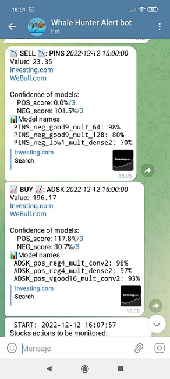

- [PROGRAM DESCRIPTION](#program-description)
  * [Instructions for use](#instructions-for-use)
      - [The alert consists of the following:](#the-alert-consists-of-the-following-)
        * [Example of how the alerts looks like in **Twitter**:](#example-of-how-the-alerts-looks-like-in---twitter---)
        * [Example of how the alerts looks like in **Telegram**:](#example-of-how-the-alerts-looks-like-in---telegram---)
  * [INTRODUCTION](#introduction)
    + [Self-fulfilling prophecy principle](#self-fulfilling-prophecy-principle)
  * [OBJECTIVE](#objective)
  * [OPERATION](#operation)
    + [**1.1** Data collection](#--11---data-collection) [**1.2** Types of indicators](#--12---types-of-indicators)
    + [**2** Indicator filtering](#--2---indicator-filtering)
    + [**3** Training TF XGB and Sklearn](#--3---training-tf-xgb-and-sklearn)
    + [**4.1** Assessing the QUALITY of these models](#--41---assessing-the-quality-of-these-models) [**4.2** Evaluating those real BENEFITS of models](#--42---evaluating-those-real-benefits-of-models)
    + [**5.1** Making predictions for the past week](#--51---making-predictions-for-the-past-week)[**5.2** Sending real-time alerts](#--52---sending-real-time-alerts)
  * [Quick start-up Run your own models](#quick-start-up-run-your-own-models)
  * [Detailed start-up](#detailed-start-up)
    + [1 Historical data collection](#1-historical-data-collection)
      - [**1.0** (Recommended) alphavantage API](#--10----recommended--alphavantage-api) [**1.1** OHLCV history of the stock must be generated.](#--11-the---ohlcv-history-of-the-stock-must-be-generated)
    + [2 Filtering technical indicators](#2-filtering-technical-indicators)
    + [3 Trian TensorFlow XGB and Sklearn](#3-trian-tensorflow-xgb-and-sklearn)
    + [4 Evaluate quality of predictive models](#4-evaluate-quality-of-predictive-models)
    + [5 Predictions](#5-predictions)
      - [**5.0** make predictions of the last week Optional Test](#--50---make-predictions-of-the-last-week-optional-test) [**5.1** Getting OHLCV data in real time](#--51---getting-ohlcv-data-in-real-time)
      - [**5.2** Setting up chatIDs and tokens in Telegram](#--52---setting-up-chatids-and-tokens-in-telegram)  [**5.3** Sending real-time alerts Telegram](#--53---sending-real-time-alerts-telegram)
- [**Possible improvements:**](#--possible-improvements---)
      - [Combine the power of the 17 models](#combine-the-power-of-the-17-models)
      - [Better use tuners](#better-use-tuners)
      - [Real-time alert with .png financial data](#real-time-alert-with-png-financial-data)
      - [Improvements in predictive models using multi-dimensional](#improvements-in-predictive-models-using-multi-dimensional)
      - [Review the way ground true is obtained](#review-the-way-ground-true-is-obtained)
      - [MonoLabel vs MultiLabel](#monolabel-vs-multilabel)
      - [Show TF heat map of the detected decison](#show-tf-heat-map-of-the-detected-decison)
      - [Testing the MachineLearning platforms of large IT companies](#testing-the-machinelearning-platforms-of-large-it-companies)
      - [Add news sentiment indicator](#add-news-sentiment-indicator)
      - [Add balance sheets](#add-balance-sheets)
      - [Recommended reading LSTM plus stock price FAIL](#recommended-reading-lstm-plus-stock-price-fail)
      - [Lighter improvements list of suggested](#lighter-improvements-list-of-suggested)
    + [USE THE SOFTWARE AT YOUR OWN RISK THE AUTHORS AND ALL AFFILIATES ASSUME NO RESPONSIBILITY FOR YOUR TRADING RESULTS](#use-the-software-at-your-own-risk-the-authors-and-all-affiliates-assume-no-responsibility-for-your-trading-results)
    + [Technical Patterns all Names](#technical-patterns-all-names)

<small><i><a href='http://ecotrust-canada.github.io/markdown-toc/'>Table of contents generated with markdown-toc</a></i></small>


## PROGRAM DESCRIPTION

**OHLCV** :An opening-high-low-closing-volume chart is a type of chart that is typically used to illustrate movements in the price of a financial instrument over time.

**Functions:**

1. Collection of historical **stocks** OHLCV data for the last years and calculation of technical patterns (momentums, volatility, Japanese candlesticks, statistics...), 1068 patterns.
1. Calculations of which of the 1068 are the most valuable, and most relevant for the detection of good trading points (buy-sell).
1. Training of several machine learning models using powerful libraries:Google Tensor Flow Sklearn and XGB
1. Evaluation of the multiple models, to discard the less reliable ones. 
1. OHLCV data collection and making predictions from the models in real time, when any of the multiple predictions (buy-sell stocks) is considered valid, sending real-time alert to Telegram and Mail. 

_**Remember**_ the scalability of the project, it receives OHLCV data but can _**receive any type of data in .csv or excel**_ for predictions, with few changes (check the structure), it would be nice to complete the development so that it can receive predictions of any type, with open source. I am willing to help. 
The predictive models generated by the solution are **_binary_**, i.e. they detect True or False.

See article in **medium.com** https://medium.com/@LuisCasti33/lectrade-machine-learning-with-technical-patterns-and-real-time-alerts-for-buying-and-selling-in-b4ecc59b29cb

### Instructions for use
- RealTime Twitter https://twitter.com/Whale__Hunters

- RealTime Telegram @Whale_Hunter_Alertbot this group is limited, to receive alert to sign up  ask via github or twitter 

The models have been trained in **_15 min_** intervals with , i.e. the alerts expire in about 7 minutes, that means that once the tweet goes out, you have +-7 minutes to decide whether to trade or not. also that the models should be used on intra-day trade._Never blindly follow the alerts, check first_. 
The alerts indicate points where **_only technical patterns have brought strong trend changes_** in the last 5 months, i.e. if these models were applied to the last 5 months they would hit 91% of the BUY SELL points, in the future no one can know. 
In other words, it is not an absolute truth.

##### The alert consists of the following:
- Can be _**BUY**_ or _**SELL**_.
- The id  of the stock, always from the USA market, in case of crypto will have the termination **_-USD_**. In case of Tesla, it is TSLA, in case of doubt with the company id , a simple google search "_Stocks XXX_".
- Link to _**Investing.com**_ news, check before making the final decision.
- Link to the candlesticks through _**TraderView.com**_, is the image shown attached with the alert. 
- 𝙈𝙤𝙙𝙚𝙡 𝙏𝙧𝙪𝙨𝙩:⬆⬇, level of strength indicating whether there is a positive or negative trend and behind / number of models used to obtain the percentage. 
It may be the case that both the uptrend POS and downtrend NEG have a high score, indicating increased volatility.
- 📊⚙𝙉𝙖𝙢𝙚𝙨:
The name of the selected models with which the prediction has been made and the percentage of strength. 

###### Example of how the alerts looks like in **Twitter**:


###### Example of how the alerts looks like in **Telegram**:


### INTRODUCTION
The stock market is moved by technical indicators, there are several types of volatility, cycle volume, candlesticks, supports, resistances, moving averages...

An excellent site to see all the stock market technical indicators is webull https://app.webull.com/trade?source=seo-google-home. 

Image: webull with Stochastic, MACD and RSI indicators


On the stock market graphs have been invented EVERY possible way to predict the stock market, with mixed results, making clear the difficulty of predicting human behavior.

These indicators indicate where to buy and sell, there are many beliefs about them (we mean in beliefs, because if they always worked we would all be rich). 

Any technical indicator can be obtained by means of programmable mathematical operations.

Three examples:

**RSI** or Relative Strength Index is an oscillator that reflects relative strength

Greater than 70 overbought, indicates that it will go down.

Less than 70 oversold, indicates that it will go higher 

**MACD** is the acronym for Moving Average Convergence / Divergence. The MACD in the stock market is used to measure the robustness of the price movement. Through the crossing of the line of this indicator and the moving average

It operates on the basis of the crossovers between these two lines

Or it is operated when both exceed zero.

**Candlestick: Morning Star** The morning star pattern is considered a hopeful sign in a bearish market trend.


These indicators are present in refuted and popular websites like investing.com to be analyzed by the market <https://es.investing.com/equities/apple-computer-inc-technical>

#### Self-fulfilling prophecy principle

It is extremely difficult to predict the price of any stock. Inflation, wars, populism, all this conditions affect the economy, and it becomes difficult, if not impossible to predict what Vladimir Putin will do tomorrow. 

Here enters the self-fulfilling prophecy principle of explained is, at first, a "false" definition of the situation, which awakens a new behavior that makes the original false conception of the situation become "true". Example:


**_The project is long and complex, it takes time to install, but the result is very beautiful._** 

_Note 29-December 2022_ 
The improvement: _Improvements in predictive models, using multi-dimensional_ 
This development is completed in the _**stocks-prediction-multi_** branch, request access without any problem. 

- The development explained in this readme, takes ONE time partition, (e.g. from 9:00 to 9:15) analyzes all the technical patterns, and sends a concussion.
- With the multidimensional development, the model analyzes TEN time partitions (e.g. from 9:00 to 12:30), with all the technical patterns of that time, a decision is made.

The generated .csv files with name _SCALA_ are for mono-dimension and the _PLAIN_ are for multidimension , there is some mix in this branch. 


### OBJECTIVE
Understanding the principle of self-fulfilling prophecy, it is possible to obtain the pattern of the same, by means of the massive collection of technical patterns, their calculation and the study of their patterns.


` `For this, techniques such as big data will be used through Pandas Python libraries, machine learning through Sklearn, XGB and neural networks through the open google Tensor Flow library. 

The result will be displayed in a simple and friendly way through alerts on mobile or computer.

The machine learnig models Sklearn, XGB and Tensor Flow , by means of the learning of the last months detect the point of sale. To detect this point of sale a series of indicators have been taken into account: olap_VMAP, ma_SMA_50, ichi_senkou_a, olap_BBAND_dif ,mtum_MACD_ext, olap_BBAND_MIDDLE, mtum_MACD_ext_signal, fibo_s1, volu_PVI_1, ma_KAMA_5, etcetera.

The image shows: MACD, RSI , Stochastic and Balance of power (Elder Ray) 

The alert is sent on the **vertical line** (the only vertical line that crosses the whole image), during the next 4 periods the stock decreases (It will be indicated as _**SELL**_) by 2.4%. Each candlestick period in the image indicates 15 minutes.


### OPERATION

#### **1.1** Data collection
Collect data to train the model

`yhoo_generate_big_all_csv.py`

The closing data is obtained through yahoo API finance, and hundreds of technical patterns are calculated using the pandas_ta and talib libraries. 

`yhoo_history_stock.get_SCALA_csv_stocks_history_Download_list()`

**Ground True is the variable** `buy_seel_point`
The model to be able to train in detecting points of purchase and sale, creates the column `buy_seel_point` has value of: 0, -100, 100. These are detected according to the maximum changes, (positive 100, negative -100) in the history of the last months, this point will be with which the training is trained, also called the *ground* true. 

Value will be assigned in buy_seel_point if the increase or decrease of the stock is greater than 2.5% in a period of 3 hours, using the get_buy_sell_points_Roll function.

Once the historical data of the stock has been obtained and all the technical indicators have been calculated, a total of 1068, files of type `AAPL_stock_history_MONTH_3_AD.csv` are generated.

Example of the file with the first eight indicators:


This data collection is customizable, you can obtain and train models of any Nasdaq stock, for other indicators or crypto-assets, it is also possible by making small changes.

**Through the Option_Historical** class it is possible to create historical data files: annual, monthly and daily.
```
**class Option_Historical**(Enum): YEARS_3 = 1, MONTH_3 = 2, MONTH_3_AD = 3, DAY_6 = 4, DAY_1 = 5
```

The files *\d_price_maxAAPL_min_max_stock_MONTH_3.csv* are generated, which store the max and min value of each column, to be read in `Model_predictions_Nrows.py` for a quick fit_scaler() (this is the "cleaning" process that the data requires before entering the AI training models) . This operation is of vital importance for a correct optimization in reading data in real time.


#### **1.2** Types of indicators
During the generation of the data collection file of point 1 `AAPL_stock_history_MONTH_3_AD.csv` 1068 technical indicators are calculated, which are divided into subtypes, based on **prefixes** in the name.

List of prefixes and an example of the name of one of them.

- Overlap: **olap_**

olap_BBAND_UPPER, olap_BBAND_MIDDLE, olap_BBAND_LOWER, 

- Momentum: **mtum_**

mtum_MACD, mtum_MACD_signal, mtum_RSI, mtum_STOCH_k,

- Volatility: **vola_**

vola_KCBe_20_2, vola_KCUe_20_2, vola_RVI_14

- Cycle patterns: **cycl_**

cycl_DCPHASE, cycl_PHASOR_inph, cycl_PHASOR_quad

- Candlestick patterns: **cdl_**

cdl_RICKSHAWMAN, cdl_RISEFALL3METHODS, cdl_SEPARATINGLINES

- Statistics: **sti_**

sti_STDDEV, sti_TSF, sti_VAR

- Moving averages: **ma_**

ma_SMA_100, ma_WMA_10, ma_DEMA_20, ma_EMA_100, ma_KAMA_10, 

- Trend: **tend_** and **ti_**

tend_renko_TR, tend_renko_brick, ti_acc_dist, ti_chaikin_10_3

- Resistors and support suffixes: **_s3, _s2, _s1, _pp, _r1, _r2, _r3**

fibo_s3, fibo_s2, fibo_s1, fibo_pp, fibo_r1, fibo_r2, fibo_r3, fibo_r2, fibo_r3

demark_s1, demark_pp, demark_r1

- Intersection point with resistance or support: **pcrh_.**

pcrh_demark_s1, pcrh_demark_pp, pcrh_demark_r1

- Intersection point with moving average or of moving averages between them: **mcrh_.**

mcrh_SMA_20_TRIMA_50, mcrh_SMA_20_WMA_50, mcrh_SMA_20_DEMA_100

- Indicators of changes in the stock index, nasdaq: **NQ_.**

NQ_SMA_20, NQ_SMA_100

Note: To see the 1068 indicators used go to the attached sheets at the end of the document.


#### **2** Indicator filtering
Execute to find out which columns are relevant for the model output

`Feature_selection_create_json.py`

It is necessary to know which of the hundreds of columns of technical data, is valid to train the neural model, and which are just noise. This will be done through correlations and Random Forest models.

Answer the question:

Which columns are most relevant for buy or sell points?

Generate the *best_selection* files, which are a raking of the best technical data to train the model, it is intended to go from 1068 columns to about 120.

For example, for the Amazon stock, point-of-purchase detection, in the period June to October 2022, the most valuable indicators are:

- Senkuo of the Ichimoku Cloud
- Chaikin Volatility 
- On-balance volume

Example of *plots_relations/best_selection_AMNZ_pos.json* file
```json
"index": {
  "12": [
    "ichi_chilou_span"
    ],
  "10": [
    "volu_Chaikin_AD"
  ],
  "9": [
    "volu_OBV"
   ],
```
Plots with the 3 best technical data are printed in the folder *plots_relations/plot.*
Example name: *TWLO_neg_buy_sell_point__ichi_chikou_span.png*


#### **3** Training TF XGB and Sklearn 
`Model_creation_models_for_a_stock.py`

this requires the selection of better columns from point #2

There are four types of predictive algorithms, AI models:

- **Gradient Boosting** consists of a set of individual [decision trees](https://www.cienciadedatos.net/documentos/py07_arboles_decision_python.html), trained sequentially, so that each new tree tries to improve on the errors of the previous trees. Sklearn Library
- **Random Forest** Random forests are an ensemble learning method for classification, regression, and other tasks that operates by constructing a multitude of decision trees at training time. Sklearn Library 
- **XGBoost** is an optimized distributed gradient boosting library designed to be highly efficient, flexible and portable. It implements machine learning algorithms under the Gradient Boosting framework. XGBoost Library 
- **TensorFlow TF** is an open source library for machine learning across a range of tasks, and developed by Google to meet their needs for systems capable of building and training neural networks to detect and decipher patterns and correlations, analogous to the learning and reasoning used by humans. TensorFlow Library 


There are POS (buy) or NEG (sell) models and there is a BOTH model (BOTH is discarded, since prediction models are binary, they only accept 2 positions, true or false).

This point generates prediction models `.sav` for XGB and Sklearn. `.h5` for Tensor Flow.

Naming Examples: *XGboost_U_neg_vgood16_s28.sav* and *TF_AMZN_pos_low1_s128.h5*

Format of the names:

- Type of AI you train with can be:
  -  XGboost, TF, TF64, GradientBoost and RandomForest
- Stock ticker AMZN for amazon , AAPL for Apple ...
- Detects points of purchase or sale pos or neg
- How many indicators have been used in the learning, can be of 4 types depending on the relevance given by point *#2 Indicator filtering*. This ranking is organized in the **MODEL_TYPE_COLM** class, 
  - vgood16 the best 16 indicators
  - good9 the best 32 indicators
  - reg4 the best 64 indicators 
  - low1 the best 128 indicators 
- Only for TF models. Depending on the density of the neurons used, defined in the class a_manage_stocks_dict. **MODEL_TF_DENSE_TYPE_ONE_DIMENSI** can take value: s28 s64 and s128

These combinations imply that for each stock 5 types of IA are created, each in pos and neg, plus for each combination the 4 technical indicator configurations are added.  This generates 40 IA models, which will be selected in point: *#4 to evaluate the QUALITY of those models.*

Each time an AI template is generated, a log file is generated: *TF_balance_TF_AAPL_pos_reg4.h5_accuracy_87.6%__loss_2.74__epochs_10[160].csv*

It contains the accuracy and loss data of the model, as well as the model training records.


#### **4.1** Assessing the QUALITY of these models 
`Model_creation_scoring.py`

To make a prediction with the AIs, new data is collected and the technical indicators with which it has been trained are calculated according to the *best_selection* files.

When the .h5 and .sav models are queried:

  Is this a point of sale? 

These answer a number that can vary between 0.1 and 4 

The higher the number the more likely it is to be a correct buy/sell point.

Each model has a rating scale on which it is considered point of sale. For some models with a rating of more than 0.4 will be enough (usually the XGboost), while for others require more than 1.5 (usually the TF).

How do you know what the threshold score is for each model?

The Model_creation_scoring.py class generates the threshold score *threshold* files, which tell which threshold point is considered the buy-sell point.

Each AI model will have its own type file:

*Models/Scoring/AAPL_neg__when_model_ok_threshold.csv*

For each action in *#3 train the TF, XGB and Sklearn models*, 40 AI models are generated. This class evaluates and selects the most accurate models so that only the most accurate ones will be executed in real time (usually between 4 and 8 are selected).

*Models/Scoring/AAPL_neg__groupby_buy_sell_point_000.json*
```json
"list_good_params": [

  "r_rf_AFRM_pos_low1_",

   "r_TF64_AFRM_pos_vgood16_",

   "r_TF64_AFRM_pos_good9_",

   "r_TF_AFRM_pos_reg4_"

],
```

#### **4.2** Evaluating those real BENEFITS of models
`Model_predictions_N_eval_profits.py`

Answer the question: 

If you leave it running for N days, how much hypothetical money do you make?

Note: this should be run on data that has not been used in the training model, preferably

*Models/eval_Profits/_AAPL_neg_ALL_stock_20221021__20221014.csv*


#### **5.1** Making predictions for the past week
`Model_predictions_Nrows.py`

You can make predictions with the real-time data of the stock.

Through the function call every 10-12min, download the real-time stock data through the yahoo financial API.
```
df_compare, df_sell = get_RealTime_buy_seel_points()
```
This run generates the log file *d_result/prediction_results_N_rows.csv*


This file and the notifications (telegram and mail) contain information about each prediction that has been made. It contains the following columns:
this point _**is deprecated**_ by _stocks-prediction-multi_ branch.
- Date: date of the prediction 
- Stock: stock 
- buy_sell: can be either NEG or POS, depending on whether it is a buy or sell transaction. 
- Close: This is the scaled value of the close value (not the actual value).
- Volume: This is the scaled value of the Volume (not the actual value).
- 88%: Fractional format ( **5/6** ) How many models have predicted a valid operating point above 88%? Five of the six analyzed 
- 93%: Fractional format ( **5/6** ), number of models above 93%.
- 95%: Fractional format ( **5/6** ), number of models above 95%.
- TF: Fractional format ( **5/6** ), number of models above 93%, whose prediction has been made with Tensor Flow models. 
- Models_names: name of the models that have tested positive, with the hit % (88%, 93%, 95%) as suffix 

Registration example
```
2022-11-07 16:00:00 MELI NEG -51.8 -85.80 5/6 0/6 0/6 0/6 1/2 TF_reg4_s128_88%, rf_good9_88%, rf_low1_88%, rf_reg4_88%, rf_vgood16_88%,**
```
To be considered a valid prediction to trade, it must have at least half of the fraction score in the 93% and TF columns.

More than half of the models have predicted with a score above 93% which is a good point for trading 


#### **5.2** Sending real-time alerts
`predict_POOL_enque_Thread.py `*multithreading glued 2s per action* 

It is possible to run it without configuring telegram point 5.2, in that case no alerts will be sent in telegram, but if the results were recorded in real time in: *d_result/prediction_real_time.csv*

There is the possibility to send alerts of purchase and sale of the share, to telegram or mail.

the multiple AI trained models are evaluated, and only those greater than 96% probability (as previously trained) are reported.

Every 15 minutes, **all** necessary indicators are calculated in real time for each action and evaluated in the AI models.

The alert indicates which models are detecting the correct buy and sell points at which to execute the transaction. 

These buy and sell alerts expire in, plus or minus 7 minutes, given the volatility of the market.

Also attached is the price at which it was detected, the time, and links to news websites.

Note: financial news should always prevail over technical indicators. 

What is displayed in DEBUG alert, is the information from *d_result/prediction_results_N_rows.csv* of the Item: 5 make predictions of the last week Test

To understand the complete information of the alert see Point 5.1 Making predictions of the last week.




### Quick start-up Run your own models
Install requirements 
```
pip install -r requirements.txt
```
Run `Utils/API_alphavantage_get_old_history.py`

Run `yhoo_generate_big_all_csv.py`

Run `Model_creation_models_for_a_stock.py`

Run `Model_creation_scoring.py`

Run `Model_predictions_Nrows.py` Optional, last week predictions 

Real time forecasts:

Run `Utils/Volume_WeBull_get_tikcers.py` Ignore in case of using default configuration 

Configure bot token see point 5**.2** Configuring chatID and tokens in Telegram

Run `predict_POOL_inque_Thread.py`

It is possible to run it without configuring telegram point **5.2**, in that case no alerts will be sent in telegram, but if the results were recorded in real time in: *d_result/prediction_real_time.csv*


### Detailed start-up
(Running times are estimated for an intel i3 and 8GB of RAM)


**0.0**The interpreter with which the tutorial has been made is python 3.8 , IDE Pycharm, caution with the compatibility between versions of the library pandas and python
For example: today do not use python 3.10 , as it is incompatible with pandashttps://stackoverflow.com/questions/69586701/unable-to-install-pandas-for-python 


**0.1** Download and install requirements, the project is powerful and demanding in terms of libraries.

pip install -r requirements.txt

**0.2** Search all files for the string `**DOCU**`

this allows to watch all files that are executable from the startup tutorial easily 

**0.3** In the file a_manage_stocks_dict.py all the configurations are stored, look at the document and know where it is.

In it there is the dictionary DICT_COMPANYS

It contains the IDs (GameStops quotes with the ID: **GME**) of the companies to analyze. You can customize and create a class from the **nasdaq** tikers, by default the key **@FOLO3** will be used which will analyze these 39 companies.
```
"@FOLO3: 
["UPST", "MELI", "TWLO", "RIVN", "SNOW", "LYFT", "ADBE", "UBER", "ZI", "QCOM", "PYPL", "SPOT", "RUN", "GTLB", "MDB", "NVDA", "AMD" ADSK", "ADSK", "AMZN", "CRWD", "NVST", "HUBS", "EPAM", "PINS", "TTD", "SNAP", "APPS", "ASAN", "AFRM", "DOCN", "ETSY", "DDOG", "SHOP", "NIO", "U", "GME", "RBLX", "CRSR"],
```
If a faster execution is desired, it is recommended to delete items from the list and leave three

#### 1 Historical data collection
##### **1.0** (Recommended) alphavantage API
` `The API yfinance , if you want price to price intervals in 15min intervals is limited to 2 months, to get more time data up to 2 years back (more data better predictive models) use the free version of the API https://www.alphavantage.co/documentation/  

Run `Utils/API_alphavantage_get_old_history.py`

The class is customizable: action intervals, months to ask, and ID action.

Note: being the free version, there is a portrait between request and request, to get a single 2 years history it takes 2-3 minutes per action. 

Once executed, the folder: *d_price/RAW_alpha* will be filled with historical OHLCV .csv of share prices. These files will be read in the next step. Example name: *alpha_GOOG_15min_20221031__20201112.csv

Check that one has been generated for each action in *d_price/RAW_alpha*.


##### **1.1** The OHLCV history of the stock must be generated.
As well as the history of technical patterns. It takes +-1 minute per share to calculate all technical patterns. 

Run `yhoo_generate_big_all_csv.py`

Once executed the folder: *d_price* will be filled with historical OHLCV .csv of share prices.

Three types of files are generated (Example of name type for action: AMD):

- *AMD_SCALA_stock_stock_history_MONTH_3_AD.csv* with all technical patterns calculated and applied a fit scaler(-100, 100), i.e. the stock prices are scaled (size: 30-90mb)
- *d_price/min_max/AMD_min_max_stock_MONTH_3_AD.csv* with scaling keys (size: 2-7kb)
- *AMD_stock_history_MONTH_3_AD.csv* the pure history of the OHLCVs (size: 2-7mb)

Note: *MONTH_3_AD* means 3 months of *API* yfinance plus the history collected from alphavantage. Point 1.0

Check that one has been generated for each action.


#### 2 Filtering technical indicators
It is necessary to separate the technical indicators which are related to buy or sell points and which are noise. 20 seconds per share 

Run `Model_creation_scoring.py`

Three files are generated for each action in the folder: *plots_relations* , relations for purchase "pos", relations for sale "neg" and relations for both "both".

- *plots_relations/best_selection_AMD_both.json*

These files contain a ranking of which technical indicator is best for each stock. 

Check that three .json have been generated for each action in *plots_relations* .

#### 3 Trian TensorFlow XGB and Sklearn  
Train the models, for each action 36 different models are trained.
15 minutes per share.

Run `Model_creation_models_for_a_stock.py`

The following files are generated for each action:

*Models/Sklearn_smote* folder:

- XGboost_AMD_yyy_xxx_.sav
- RandomForest_AMD_yyy_xxx_.sav
- XGboost_AMD_yyy_xxx_.sav

*Models/TF_balance* folder:

- TF_AMD_yyy_xxx_zzz.h5
- TF_AMD_yyy_xxx_zzz.h5_accuracy_71.08%__loss_0.59__epochs_10[160].csv

xxx can take value vgood16 good9 reg4 and low1 

yyy can take value "pos" and "neg".

zzz can take value s28 s64 and s128

Check that all combinations of files exposed by each action have been generated in the /Models subfolders.


#### 4 Evaluate quality of predictive models 
From the 36 models created for each OHLCV history of each stock, only the best ones will be run in real time, in order to select and evaluate those best ones.

Run `Model_creation_scoring.py`

In the *Models/Scoring* folder

AMD_yyy__groupby_buy_sell_point_000.json

AMD_yyy__when_model_ok_threshold.csv

Check that two have been generated for each action.


#### 5 Predictions
##### **5.0** make predictions of the last week Optional Test 
Run `Model_predictions_Nrows.py`

This run generates the log file *d_result/prediction_results_N_rows.csv*

Generates a sample file with predictions for the last week, data obtained with yfinance. 

Check that records exist 


##### **5.1** Getting OHLCV data in real time
In case you want to predict actions in the @FOLO3 list, ignore this point. 

It is difficult to get real time OHLCV, especially volume (yfinance gives real time volume, but this is not a correct value and after 1-2 hours it changes, making it unfeasible to use yfinance for real time predictions).

To get correct volumes in real time, queries are made to webull, for each stock every 2.5 minutes, a webull ID is required, the default ones @FOLO3 are cached and downloaded in *a_manage_stocks_dict.py. DICT_WEBULL_ID*

But if you want to use actions outside the list @FOLO3 

In Utils/Volume_WeBull_get_tikcers.py

Change the example list:
```
list_stocks = ["NEWS", "STOCKS", "WEBULL", "IDs"]
```
By the nasdaq ticker, of the webull ID you want to get.

Run Utils/Volume_WeBull_get_tikcers.py

Once executed it will show a list on screen, that must be added in *a_manage_stocks_dict.py.DICT_WEBULL_ID*
```
"MELI" : 913323000,
"TWLO" : 913254000,
```

##### **5.2** Setting up chatIDs and tokens in Telegram
You have to get the telegram token and create a channel. 

You can get the token by following the tutorial: [https:](https://www.siteguarding.com/en/how-to-get-telegram-bot-api-token)//www.siteguarding.com/en/how-to-get-telegram-bot-api-token 

With the token update the variable of ztelegram_send_message_handle.py
``` python
#Get from telegram
TOKEN = **"00000000xxxxxxx"**
```
Once the token has been obtained, the chatId of the users and administrator must be obtained. 

Users only receive purchase and startup sale alerts, while the administrator receives alerts from users as well as possible problems.

To get the chatId of each user run ztelegram_send_message_UptateUser.py and then write any message to the bot, the chadID appears both in the console and in the user's chadID 
```
*[>>> BOT] Message Send on 2022-11-08 22:30:31:31*
`	`*Text: You "User nickname " send me:* 
*"Hello world"*
` `*ChatId: "5058733760".*
`	`*From: Bot name*
`	`*Message ID: 915*
`	`*CHAT ID: 500000760*
*-----------------------------------------------*
Pick up *CHAT ID: 500000760*
```
With the chatId of the desired users, add them to the LIST_PEOPLE_IDS_CHAT list.

in ztelegram_send_message_handle.py


##### **5.3** Sending real-time alerts Telegram
It is possible to run it without configuring telegram, in that case no alerts will be sent in telegram, but the results will be recorded in real time in: *d_result/prediction_real_time.csv*

It will be reported in console via: 

`is_token_telegram_configurated()` - Results will be recorded in real time, but no alert will be sent on telegram. File: *d_result/prediction_real_time.csv*

`is_token_telegram_configurated()` - There is no value for the telegram TOKEN, telegram is required to telegram one*

The criteria to send alert or not is defined in the method ztelegram_send_message.will_send_alert(). If more than half of the models have a score greater than 93% or the TF models have a score greater than 93%, an alert is sent to the consumer users. 

Run `predict_POOL_inque_Thread.py`

In this class there are 2 types of threads 

- Producer , constantly asks for OHLCV data, once it is obtained, it enters it into a queue. 
- Consumer (2 threads running simultaneously) are pulling OHLCV data from the queue, calculating technical parameters, making model predictions, registering them in zTelegram_Registers.csv, and if they meet the requirements they are sent by telegram. 


## **Possible improvements:**
##### Combine the power of the 17 models
would be to combine the power of the 17 models tested at  https://github.com/huseinzol05/Stock-Prediction-Models predictive models with https://github.com/Leci37/stocks-Machine-learning-RealTime-telegram/tree/develop real-time pattern calculation and alerting capabilities.
Should be implemented in the method `train_model_with_custom_columns(name_model, columns_list, csv_file_SCALA, op_buy_sell : a_manage_stocks_dict.Op_buy_sell):`
For multidimension branch: `get_dicts_models_multi_dimension(self). `

another interesting improvement is the addition of PYTORCH, is the tensor flow "competence". 

##### Better use tuners
Even if the testing of the 17 models improves the result , the ML libraries, offer **_"tuners"_**, tools that test all desired combinations and turn the ideal configuration for that data. For tensor flow, see https://www.tensorflow.org/tutorials/keras/keras_tuner 
In the project there are several intents of use: `Model_finetune_TF.py`, `Model_finetune_TF_2.py` and `Model_finetune_XGB.py`. 
Running the "tuners" code is very heavy on the computer. 
You can add more models (the 17 for example) and tune them with keras_tuner.
Example of the multiple values that keras_tuner allows: 
``` python
neurons = [2, 4,8,16,24,28,32,32,44,52,64,92,92]]
weight_constraint = [1.0, 3.0, 4.0, 5.0, 7.0]
dropout_rate = [0.0, 0.1, 0.2, 0.2, 0.3, 0.4, 0.5, 0.6, 0.7, 0.8, 0.9]
hp_learning_rate = hp.Choice('learning_rate', values=[1e-2, 1e-3, 1e-4, 1e-5])
param_grid = dict(model__dropout_rate=dropout_rate, model__weight_constraint=weight_constraint, model__neurons=neurons).
model = KerasClassifier(model=create_model_2, epochs=100, batch_size=10, verbose=2)
```
More information:
https://www.simplilearn.com/tutorials/deep-learning-tutorial/keras-tuner and 
https://machinelearningmastery.com/grid-search-hyperparameters-deep-learning-models-python-keras/

##### Real-time alert with .png financial data

You can add to the alerts the summary of the financial information from TraderView.com, this image will always be loaded with the financial-analyst information in real time.  
Image is generated by code `__create_find_data_png_trader_view(path_png + "_TRAVIEW_finan.png")`

Example of summary:


##### Improvements in predictive models using multi-dimensional 
**Solved** in _stocks-prediction-multi_ branch (ask for it without any problem).
Improvements in TF predictive models using tensors (multiple matrices over time) and non-matrices (mono temporal, current design). 

In the class `Model_TF_definitions.ModelDefinition.py`

Through it, the model configurations, density, number of neurons, etc. are obtained.

There are two methods:

- `get_dicts_models_One_dimension()` is currently used and generates TF model configurations for arrays. 
- `get_dicts_models_multi_dimension()` is not in use, it is set to give multiple model configurations using tensors. 

There is the `Utils.Utils_model_predict.df_to_df_multidimension_array(dataframe, BACHT_SIZE_LOOKBACK)` method, which transforms 2-dimensional df [columns , rows] to 3-dimensional df [columns , files, BACHT_SIZE_LOOKBACK ].

BACHT_SIZE_LOOKBACK means how many records in the past tense are added to the df, the number is configurable and default value is eight.

To start the development must be to call the method with BACHT_SIZE_LOOKBACK with an integer value, the method will return a multidimensional df [columns, files, BACHT_SIZE_LOOKBACK ], with which to feed the TF models.

Utils_model_predict.scaler_split_TF_onbalance(df, label_name=Y_TARGET, BACHT_SIZE_LOOKBACK=8)

**Improvement**: Once these multidimensional arrays are returned, models are obtained with `get_dicts_models_multi_dimension()`, it is not possible to train a model and make a prediction with multidimensional arrays. 

##### Review the way ground true is obtained 
Before training the models the intervals (of 15min) are classified as buy point 100 or 101, sell point -100 or .-101 or no trade point 0, these values are entered in the column Y_TARGET = **'buy_sell_point'** through the method `Utils.Utils_buy_sell_points.get_buy_sell_points_Roll()`.  

The variation is calculated with respect to the following 12 windows (15min \* 12 = 3 hours), and from there the 8% points of greatest rise and greatest fall are obtained, and these points are assigned values other than 0.

To obtain the Y_TARGET there are 2 methods that are responsible for the strategy to follow once you buy and sell, in case of loss will opt for Stop Loss.

`rolling_get_sell_price_POS()` and `rolling_get_sell_price_NEG()`

**Optional improvement**: the current system decides by percentages, i.e. the 16% highest rises and falls (8% each) are ground true. I.e. there are rises or falls greater than 3% that can be left out if the stock is very volatile.

##### MonoLabel vs MultiLabel
The models are binary, i.e., some POS models are generated to detect only points of purchase and other NEG to detect only points of sale, these predictive models only detect True or False.

  You can try to add a multi-label detection, this would translate into Buy, Sell, Nothing preconditions. 
Hint: look for ` activation='sigmoid'` and implement https://stackoverflow.com/questions/55936546/binary-and-multi-class-classification-code-change 

#####  Show TF heat map of the detected decison 
When making TF image predictions, it provides the **_heat map_**, i.e., what pixels it looked at to make the decision.
Which of the technical patterns provided (in 3d array format)? 
forming the heat map, of the given preconditions 
Example for TF cat detection:


##### Testing the MachineLearning platforms of large IT companies 

Once you have obtained the history (example named _GOOG_PLAIN_stock_history_MONTH_3.csv_) with the technical patterns of the stock you can try using the prediction services of the big IT companies:  
1. Google: https://cloud.google.com/vertex-ai/docs/beginner/beginners-guide 
2. Microsotf Azure: https://learn.microsoft.com/es-es/azure/machine-learning/how-to-use-automated-ml-for-ml-models
3. AWS: https://aws.amazon.com/es/getting-started/hands-on/machine-learning-tutorial-automatically-create-models/ 

_**Usage experience:**_
Dic-2022 (Azure and Google allow you to export locally from model and make predictions locally without relying on the clouds, AWS for the moment forces you to make predictions in their cloud, making the cost of maintenance much more expensive (I have not tested AWS in depth for that reason).
Azure takes a lot of time (more than 15h)  tests many more models, many fail and you have to pay for the time it takes to fail. 
`ERROR: Unexpected bus error encountered in worker. This might be caused by insufficient shared memory (shm).`

_**Google**_ goes faster, but does not support for the moment any result better than the one obtained locally.


 

Both allow you to easily download the models created, **_Azure_** with .py files for guidance. 


More models, more power Azure, it is also more expensive.


##### Add news sentiment indicator
You get the news for each stock with `news_get_data_NUTS.get_news_sentiment_data()` this method gets all the associated news from: INVESTING.com, YAHOO.com and FINVIZ.COM.

( it uses investpy API , which recently october 2022 has started to fail , probably due to investing[.com](https://github.com/alvarobartt/investpy) blocking <https://github.com/alvarobartt/investpy> )

Once these news items are obtained, the method `news_sentiment_va_and_txtBlod.get_sentiment_predictorS()` proceeds to evaluate and score from -100 negative to 100 positive, using 4 models. It is convenient to introduce more news pages

The models are downloaded from the internet, either via AI models or libraries, you can find the references in:
```
news_sentiment_flair.get_sentiment_flair
news_sentiment_t5.get_sentiment_t5
news_sentiment_t5.get_sentiment_t5Be
get_sentiment_textBlod
```
Run `news_get_data_NUTS.get_json_news_sentimet()`

A .csv and .json file is generated, with action date the four models, the score and the news collected Example: *d_sentiment/stock_news_DATE_MELI.csv*


**Improvement**: Once the sentiment-news score file is obtained, introduce it in the predictive models together with the technical indicators, it must be done in real time.


##### Add balance sheets
Economic balances can be added easily using the yahoo API

<https://github.com/ranaroussi/yfinance>

\# show financials
```
msft.financials
msft.quarterly_financials
```
These balances are updated every quarter.

You can get the dates of publication of results in yahoo API

\# show next event (earnings, etc)
```
msft.calendar
```
\# show all earnings dates
```
msft.earnings_dates
```
#####  Recommended reading LSTM plus stock price FAIL
This does not understand the principle of self-fulfilling prophecy (explained at the beginning), but it is worth considering. 
_LSTM time series + stock price prediction = FAIL_ 
[https://www.kaggle.com/code/carlmcbrideellis/lstm-time-series-stock-price-prediction-fail ](https://www.kaggle.com/code/carlmcbrideellis/lstm-time-series-stock-price-prediction-fail)

##### Lighter improvements list of suggested

Allow to analyze stocks outside the nasdaq, change in :

`yhoo_history_stock._select_dowload_time_config()`

Utils/API_alphavantage_get_old_history.py

Redirect remaining `print()` to `Logger.logr.debug()`

Translate through <https://www.deepl.com/> the possible remaining messages in Spanish to English. 

The plots generated in the *plots_relations/plot* folder by 

Change the operation of the bot, that is enough to send the command `\start`, and remove the case of execution of `ztelegram_send_message_UptateUser.py` described in point: 5.2

Send real time email alert

Revise Stock prediction fail LSTM , **Solved** in _stocks-prediction-multi_ branch

Find the explanation of what indicators and values the AI model takes, to predict what it predicts and give a small explanation-schema, for example random forest models if you can print the sequence that makes the prediction. 

(green buy, red do not trade) https://stackoverflow.com/questions/40155128/plot-trees-for-a-random-forest-in-python-with-scikit-learn 


#### USE THE SOFTWARE AT YOUR OWN RISK THE AUTHORS AND ALL AFFILIATES ASSUME NO RESPONSIBILITY FOR YOUR TRADING RESULTS
USE THE SOFTWARE AT YOUR OWN RISK THE AUTHORS AND ALL AFFILIATES ASSUME NO RESPONSIBILITY FOR YOUR TRADING RESULTS. Do not risk money which you are afraid to lose. There might be bugs in the code - this software DOES NOT come with ANY warranty.
Permitted, free use and modification, but no commercialization to third parties, without authorization. All rights reserved

#### Technical Patterns all Names
All patterns used 
```
Date	buy_sell_point	Open	High	Low	Close	Volume	per_Close	per_Volume	has_preMarket
  per_preMarket	olap_BBAND_UPPER	olap_BBAND_MIDDLE	olap_BBAND_LOWER	olap_BBAND_UPPER_crash	
  olap_BBAND_LOWER_crash	olap_BBAND_dif	olap_HT_TRENDLINE	olap_MIDPOINT	olap_MIDPRICE	olap_SAR	
  olap_SAREXT	mtum_ADX	mtum_ADXR	mtum_APO	mtum_AROON_down	mtum_AROON_up	mtum_AROONOSC	mtum_BOP	
  mtum_CCI	mtum_CMO	mtum_DX	mtum_MACD	mtum_MACD_signal	mtum_MACD_list	mtum_MACD_crash	mtum_MACD_ext
  mtum_MACD_ext_signal	mtum_MACD_ext_list	mtum_MACD_ext_crash	mtum_MACD_fix	mtum_MACD_fix_signal	
  mtum_MACD_fix_list	mtum_MACD_fix_crash	mtum_MFI	mtum_MINUS_DI	mtum_MINUS_DM	mtum_MOM	
  mtum_PLUS_DI	mtum_PLUS_DM	mtum_PPO	mtum_ROC	mtum_ROCP	mtum_ROCR	mtum_ROCR100	
  mtum_RSI	mtum_STOCH_k	mtum_STOCH_d	mtum_STOCH_kd	mtum_STOCH_crash	mtum_STOCH_Fa_k	
  mtum_STOCH_Fa_d	mtum_STOCH_Fa_kd	mtum_STOCH_Fa_crash	mtum_STOCH_RSI_k	mtum_STOCH_RSI_d	
  mtum_STOCH_RSI_kd	mtum_STOCH_RSI_crash	mtum_TRIX	mtum_ULTOSC	mtum_WILLIAMS_R	volu_Chaikin_AD
volu_Chaikin_ADOSC	volu_OBV	vola_ATR	vola_NATR	vola_TRANGE	cycl_DCPERIOD	cycl_DCPHASE	
cycl_PHASOR_inph	cycl_PHASOR_quad	cycl_SINE_sine	cycl_SINE_lead	cycl_HT_TRENDMODE	cdl_2CROWS	
cdl_3BLACKCROWS	cdl_3INSIDE	cdl_3LINESTRIKE	cdl_3OUTSIDE	cdl_3STARSINSOUTH	cdl_3WHITESOLDIERS	
cdl_ABANDONEDBABY	cdl_ADVANCEBLOCK	cdl_BELTHOLD	cdl_BREAKAWAY	cdl_CLOSINGMARUBOZU	
cdl_CONCEALBABYSWALL	cdl_COUNTERATTACK	cdl_DARKCLOUDCOVER	cdl_DOJI	cdl_DOJISTAR	
cdl_DRAGONFLYDOJI	cdl_ENGULFING	cdl_EVENINGDOJISTAR	cdl_EVENINGSTAR	cdl_GAPSIDESIDEWHITE	
cdl_GRAVESTONEDOJI	cdl_HAMMER	cdl_HANGINGMAN	cdl_HARAMI	cdl_HARAMICROSS	cdl_HIGHWAVE
cdl_HIKKAKE	cdl_HIKKAKEMOD	cdl_HOMINGPIGEON	cdl_IDENTICAL3CROWS	cdl_INNECK	cdl_INVERTEDHAMMER
cdl_KICKING	cdl_KICKINGBYLENGTH	cdl_LADDERBOTTOM	cdl_LONGLEGGEDDOJI	cdl_LONGLINE	
cdl_MARUBOZU	cdl_MATCHINGLOW	cdl_MATHOLD	cdl_MORNINGDOJISTAR	cdl_MORNINGSTAR	cdl_ONNECK	
cdl_PIERCING	cdl_RICKSHAWMAN	cdl_RISEFALL3METHODS	cdl_SEPARATINGLINES	cdl_SHOOTINGSTAR
cdl_SHORTLINE	cdl_SPINNINGTOP	cdl_STALLEDPATTERN	cdl_STICKSANDWICH	cdl_TAKURI
cdl_TASUKIGAP	cdl_THRUSTING	cdl_TRISTAR	cdl_UNIQUE3RIVER	cdl_UPSIDEGAP2CROWS
cdl_XSIDEGAP3METHODS	sti_BETA	sti_CORREL	sti_LINEARREG	sti_LINEARREG_ANGLE	sti_LINEARREG_INTERCEPT	
sti_LINEARREG_SLOPE	sti_STDDEV	sti_TSF	sti_VAR	ma_DEMA_5	ma_EMA_5	ma_KAMA_5	ma_SMA_5	ma_T3_5	ma_TEMA_5
ma_TRIMA_5	ma_WMA_5	ma_DEMA_10	ma_EMA_10	ma_KAMA_10	ma_SMA_10	ma_T3_10	ma_TEMA_10	ma_TRIMA_10
ma_WMA_10	ma_DEMA_20	ma_EMA_20	ma_KAMA_20	ma_SMA_20	ma_T3_20	ma_TEMA_20	ma_TRIMA_20	ma_WMA_20
ma_DEMA_50	ma_EMA_50	ma_KAMA_50	ma_SMA_50	ma_T3_50	ma_TEMA_50	ma_TRIMA_50	ma_WMA_50	
ma_DEMA_100	ma_EMA_100	ma_KAMA_100	ma_SMA_100	ma_T3_100	ma_TEMA_100	ma_TRIMA_100	ma_WMA_100	trad_s3	trad_s2	trad_s1	
trad_pp	trad_r1	trad_r2	trad_r3	clas_s3	clas_s2	clas_s1	clas_pp	clas_r1	clas_r2	clas_r3	fibo_s3	fibo_s2	fibo_s1	fibo_pp	fibo_r1
fibo_r2	fibo_r3	wood_s3	wood_s2	wood_s1	wood_pp	wood_r1	wood_r2	wood_r3	demark_s1	demark_pp	demark_r1	cama_s3	cama_s2
cama_s1	cama_pp	cama_r1	cama_r2	cama_r3	ti_acc_dist	ti_chaikin_10_3	ti_choppiness_14	ti_coppock_14_11_10
ti_donchian_lower_20	ti_donchian_center_20	ti_donchian_upper_20	ti_ease_of_movement_14	ti_force_index_13
ti_hma_20	ti_kelt_20_lower	ti_kelt_20_upper	ti_mass_index_9_25	ti_supertrend_20	ti_vortex_pos_5
ti_vortex_neg_5	ti_vortex_pos_14	ti_vortex_neg_14	cycl_EBSW_40_10	mtum_AO_5_34	mtum_BIAS_SMA_26
mtum_AR_26	mtum_BR_26	mtum_CFO_9	mtum_CG_10	mtum_CTI_12	mtum_DMP_14	mtum_DMN_14	mtum_ER_10
mtum_BULLP_13	mtum_BEARP_13	mtum_FISHERT_9_1	mtum_FISHERTs_9_1	mtum_INERTIA_20_14	mtum_K_9_3	mtum_D_9_3	mtum_J_9_3
mtum_PGO_14	mtum_PSL_12	mtum_PVO_12_26_9	mtum_PVOh_12_26_9	mtum_PVOs_12_26_9	mtum_QQE_14_5_4236_RSIMA	
mtum_QQEl_14_5_4236	mtum_QQEs_14_5_4236	mtum_RSX_14	mtum_STC_10_12_26_05	mtum_STCmacd_10_12_26_05	
mtum_STCstoch_10_12_26_05	mtum_SMI_5_20_5	mtum_SMIs_5_20_5	mtum_SMIo_5_20_5	olap_ALMA_10_60_085	olap_HWMA_02_01_01	
olap_JMA_7_0	olap_MCGD_10	olap_PWMA_10	olap_SINWMA_14	olap_SSF_10_2	olap_SWMA_10	olap_VMAP	olap_VWMA_10	
perf_CUMLOGRET_1	perf_CUMPCTRET_1	perf_z_30_1	perf_ha	sti_ENTP_10	sti_KURT_30	sti_TOS_STDEVALL_LR	sti_TOS_STDEVALL_L_1	
sti_TOS_STDEVALL_U_1	sti_TOS_STDEVALL_L_2	sti_TOS_STDEVALL_U_2	sti_TOS_STDEVALL_L_3	sti_TOS_STDEVALL_U_3	
sti_ZS_30	tend_LDECAY_5	tend_PSARl_002_02	tend_PSARs_002_02	tend_PSARaf_002_02	tend_PSARr_002_02	tend_VHF_28	
vola_HWM	vola_HWU	vola_HWL	vola_KCLe_20_2	vola_KCBe_20_2	vola_KCUe_20_2	vola_RVI_14	vola_THERMO_20_2_05
vola_THERMOma_20_2_05	vola_THERMOl_20_2_05	vola_THERMOs_20_2_05	vola_TRUERANGE_1	vola_UI_14	volu_EFI_13	
volu_NVI_1	volu_PVI_1	volu_PVOL	volu_PVR	volu_PVT	mtum_murrey_math	mtum_td_seq	mtum_td_seq_sig	tend_hh	
tend_hl	tend_ll	tend_lh	tend_hh_crash	tend_hl_crash	tend_ll_crash	tend_lh_crash	ichi_tenkan_sen	ichi_kijun_sen	
ichi_senkou_a	ichi_senkou_b	ichi_isin_cloud	ichi_crash	ichi_chikou_span	tend_renko_TR	tend_renko_ATR	
tend_renko_brick	tend_renko_change	pcrh_trad_s3	pcrh_trad_s2	pcrh_trad_s1	pcrh_trad_pp	pcrh_trad_r1	
pcrh_trad_r2	pcrh_trad_r3	pcrh_clas_s3	pcrh_clas_s2	pcrh_clas_s1	pcrh_clas_pp	pcrh_clas_r1	
pcrh_clas_r2	pcrh_clas_r3	pcrh_fibo_s3	pcrh_fibo_s2	pcrh_fibo_s1	pcrh_fibo_pp	pcrh_fibo_r1	
pcrh_fibo_r2	pcrh_fibo_r3	pcrh_wood_s3	pcrh_wood_s2	pcrh_wood_s1	pcrh_wood_pp	pcrh_wood_r1	
pcrh_wood_r2	pcrh_wood_r3	pcrh_demark_s1	pcrh_demark_pp	pcrh_demark_r1	pcrh_cama_s3	pcrh_cama_s2	
pcrh_cama_s1	pcrh_cama_pp	pcrh_cama_r1	pcrh_cama_r2	pcrh_cama_r3	mcrh_DEMA_5_DEMA_10	mcrh_DEMA_5_EMA_10	
mcrh_DEMA_5_KAMA_10	mcrh_DEMA_5_SMA_10	mcrh_DEMA_5_T3_10	mcrh_DEMA_5_TEMA_10	mcrh_DEMA_5_TRIMA_10	
mcrh_DEMA_5_WMA_10	mcrh_DEMA_5_DEMA_20	mcrh_DEMA_5_EMA_20	mcrh_DEMA_5_KAMA_20	mcrh_DEMA_5_SMA_20	mcrh_DEMA_5_T3_20	
mcrh_DEMA_5_TEMA_20	mcrh_DEMA_5_TRIMA_20	mcrh_DEMA_5_WMA_20	mcrh_DEMA_5_DEMA_50	mcrh_DEMA_5_EMA_50	
mcrh_DEMA_5_KAMA_50	mcrh_DEMA_5_SMA_50	mcrh_DEMA_5_T3_50	mcrh_DEMA_5_TEMA_50	mcrh_DEMA_5_TRIMA_50	
mcrh_DEMA_5_WMA_50	mcrh_DEMA_5_DEMA_100	mcrh_DEMA_5_EMA_100	mcrh_DEMA_5_KAMA_100	mcrh_DEMA_5_SMA_100	
mcrh_DEMA_5_T3_100	mcrh_DEMA_5_TEMA_100	mcrh_DEMA_5_TRIMA_100	mcrh_DEMA_5_WMA_100	mcrh_DEMA_5_ti_h20	
mcrh_EMA_5_DEMA_10	mcrh_EMA_5_EMA_10	mcrh_EMA_5_KAMA_10	mcrh_EMA_5_SMA_10	mcrh_EMA_5_T3_10	mcrh_EMA_5_TEMA_10	
mcrh_EMA_5_TRIMA_10	mcrh_EMA_5_WMA_10	mcrh_EMA_5_DEMA_20	mcrh_EMA_5_EMA_20	mcrh_EMA_5_KAMA_20	mcrh_EMA_5_SMA_20	
mcrh_EMA_5_T3_20	mcrh_EMA_5_TEMA_20	mcrh_EMA_5_TRIMA_20	mcrh_EMA_5_WMA_20	mcrh_EMA_5_DEMA_50	mcrh_EMA_5_EMA_50	
mcrh_EMA_5_KAMA_50	mcrh_EMA_5_SMA_50	mcrh_EMA_5_T3_50	mcrh_EMA_5_TEMA_50	mcrh_EMA_5_TRIMA_50	mcrh_EMA_5_WMA_50	
mcrh_EMA_5_DEMA_100	mcrh_EMA_5_EMA_100	mcrh_EMA_5_KAMA_100	mcrh_EMA_5_SMA_100	mcrh_EMA_5_T3_100	mcrh_EMA_5_TEMA_100	
mcrh_EMA_5_TRIMA_100	mcrh_EMA_5_WMA_100	mcrh_EMA_5_ti_h20	mcrh_KAMA_5_DEMA_10	mcrh_KAMA_5_EMA_10	mcrh_KAMA_5_KAMA_10
mcrh_KAMA_5_SMA_10	mcrh_KAMA_5_T3_10	mcrh_KAMA_5_TEMA_10	mcrh_KAMA_5_TRIMA_10	mcrh_KAMA_5_WMA_10	
mcrh_KAMA_5_DEMA_20	mcrh_KAMA_5_EMA_20	mcrh_KAMA_5_KAMA_20	mcrh_KAMA_5_SMA_20	mcrh_KAMA_5_T3_20	mcrh_KAMA_5_TEMA_20	
mcrh_KAMA_5_TRIMA_20	mcrh_KAMA_5_WMA_20	mcrh_KAMA_5_DEMA_50	mcrh_KAMA_5_EMA_50	mcrh_KAMA_5_KAMA_50	mcrh_KAMA_5_SMA_50	
mcrh_KAMA_5_T3_50	mcrh_KAMA_5_TEMA_50	mcrh_KAMA_5_TRIMA_50	mcrh_KAMA_5_WMA_50	mcrh_KAMA_5_DEMA_100	mcrh_KAMA_5_EMA_100
mcrh_KAMA_5_KAMA_100	mcrh_KAMA_5_SMA_100	mcrh_KAMA_5_T3_100	mcrh_KAMA_5_TEMA_100	mcrh_KAMA_5_TRIMA_100	
mcrh_KAMA_5_WMA_100	mcrh_KAMA_5_ti_h20	mcrh_SMA_5_DEMA_10	mcrh_SMA_5_EMA_10	mcrh_SMA_5_KAMA_10	mcrh_SMA_5_SMA_10	
mcrh_SMA_5_T3_10	mcrh_SMA_5_TEMA_10	mcrh_SMA_5_TRIMA_10	mcrh_SMA_5_WMA_10	mcrh_SMA_5_DEMA_20	mcrh_SMA_5_EMA_20	
mcrh_SMA_5_KAMA_20	mcrh_SMA_5_SMA_20	mcrh_SMA_5_T3_20	mcrh_SMA_5_TEMA_20	mcrh_SMA_5_TRIMA_20	mcrh_SMA_5_WMA_20	
mcrh_SMA_5_DEMA_50	mcrh_SMA_5_EMA_50	mcrh_SMA_5_KAMA_50	mcrh_SMA_5_SMA_50	mcrh_SMA_5_T3_50	mcrh_SMA_5_TEMA_50	
mcrh_SMA_5_TRIMA_50	mcrh_SMA_5_WMA_50	mcrh_SMA_5_DEMA_100	mcrh_SMA_5_EMA_100	mcrh_SMA_5_KAMA_100	mcrh_SMA_5_SMA_100	
mcrh_SMA_5_T3_100	mcrh_SMA_5_TEMA_100	mcrh_SMA_5_TRIMA_100	mcrh_SMA_5_WMA_100	mcrh_SMA_5_ti_h20	mcrh_T3_5_DEMA_10	
mcrh_T3_5_EMA_10	mcrh_T3_5_KAMA_10	mcrh_T3_5_SMA_10	mcrh_T3_5_T3_10	mcrh_T3_5_TEMA_10	mcrh_T3_5_TRIMA_10	
mcrh_T3_5_WMA_10	mcrh_T3_5_DEMA_20	mcrh_T3_5_EMA_20	mcrh_T3_5_KAMA_20	mcrh_T3_5_SMA_20	mcrh_T3_5_T3_20	
mcrh_T3_5_TEMA_20	mcrh_T3_5_TRIMA_20	mcrh_T3_5_WMA_20	mcrh_T3_5_DEMA_50	mcrh_T3_5_EMA_50	mcrh_T3_5_KAMA_50	
mcrh_T3_5_SMA_50	mcrh_T3_5_T3_50	mcrh_T3_5_TEMA_50	mcrh_T3_5_TRIMA_50	mcrh_T3_5_WMA_50	mcrh_T3_5_DEMA_100	
mcrh_T3_5_EMA_100	mcrh_T3_5_KAMA_100	mcrh_T3_5_SMA_100	mcrh_T3_5_T3_100	mcrh_T3_5_TEMA_100	mcrh_T3_5_TRIMA_100	
mcrh_T3_5_WMA_100	mcrh_T3_5_ti_h20	mcrh_TEMA_5_DEMA_10	mcrh_TEMA_5_EMA_10	mcrh_TEMA_5_KAMA_10	mcrh_TEMA_5_SMA_10	
mcrh_TEMA_5_T3_10	mcrh_TEMA_5_TEMA_10	mcrh_TEMA_5_TRIMA_10	mcrh_TEMA_5_WMA_10	mcrh_TEMA_5_DEMA_20	mcrh_TEMA_5_EMA_20	
mcrh_TEMA_5_KAMA_20	mcrh_TEMA_5_SMA_20	mcrh_TEMA_5_T3_20	mcrh_TEMA_5_TEMA_20	mcrh_TEMA_5_TRIMA_20	mcrh_TEMA_5_WMA_20	
mcrh_TEMA_5_DEMA_50	mcrh_TEMA_5_EMA_50	mcrh_TEMA_5_KAMA_50	mcrh_TEMA_5_SMA_50	mcrh_TEMA_5_T3_50	mcrh_TEMA_5_TEMA_50	
mcrh_TEMA_5_TRIMA_50	mcrh_TEMA_5_WMA_50	mcrh_TEMA_5_DEMA_100	mcrh_TEMA_5_EMA_100	mcrh_TEMA_5_KAMA_100	
mcrh_TEMA_5_SMA_100	mcrh_TEMA_5_T3_100	mcrh_TEMA_5_TEMA_100	mcrh_TEMA_5_TRIMA_100	mcrh_TEMA_5_WMA_100	
mcrh_TEMA_5_ti_h20	mcrh_TRIMA_5_DEMA_10	mcrh_TRIMA_5_EMA_10	mcrh_TRIMA_5_KAMA_10	mcrh_TRIMA_5_SMA_10	
mcrh_TRIMA_5_T3_10	mcrh_TRIMA_5_TEMA_10	mcrh_TRIMA_5_TRIMA_10	mcrh_TRIMA_5_WMA_10	mcrh_TRIMA_5_DEMA_20	
mcrh_TRIMA_5_EMA_20	mcrh_TRIMA_5_KAMA_20	mcrh_TRIMA_5_SMA_20	mcrh_TRIMA_5_T3_20	mcrh_TRIMA_5_TEMA_20	
mcrh_TRIMA_5_TRIMA_20	mcrh_TRIMA_5_WMA_20	mcrh_TRIMA_5_DEMA_50	mcrh_TRIMA_5_EMA_50	mcrh_TRIMA_5_KAMA_50	
mcrh_TRIMA_5_SMA_50	mcrh_TRIMA_5_T3_50	mcrh_TRIMA_5_TEMA_50	mcrh_TRIMA_5_TRIMA_50	mcrh_TRIMA_5_WMA_50	
mcrh_TRIMA_5_DEMA_100	mcrh_TRIMA_5_EMA_100	mcrh_TRIMA_5_KAMA_100	mcrh_TRIMA_5_SMA_100	mcrh_TRIMA_5_T3_100	
mcrh_TRIMA_5_TEMA_100	mcrh_TRIMA_5_TRIMA_100	mcrh_TRIMA_5_WMA_100	mcrh_TRIMA_5_ti_h20	mcrh_WMA_5_DEMA_10	
mcrh_WMA_5_EMA_10	mcrh_WMA_5_KAMA_10	mcrh_WMA_5_SMA_10	mcrh_WMA_5_T3_10	mcrh_WMA_5_TEMA_10	mcrh_WMA_5_TRIMA_10	
mcrh_WMA_5_WMA_10	mcrh_WMA_5_DEMA_20	mcrh_WMA_5_EMA_20	mcrh_WMA_5_KAMA_20	mcrh_WMA_5_SMA_20	mcrh_WMA_5_T3_20	
mcrh_WMA_5_TEMA_20	mcrh_WMA_5_TRIMA_20	mcrh_WMA_5_WMA_20	mcrh_WMA_5_DEMA_50	mcrh_WMA_5_EMA_50	mcrh_WMA_5_KAMA_50	
mcrh_WMA_5_SMA_50	mcrh_WMA_5_T3_50	mcrh_WMA_5_TEMA_50	mcrh_WMA_5_TRIMA_50	mcrh_WMA_5_WMA_50	mcrh_WMA_5_DEMA_100	
mcrh_WMA_5_EMA_100	mcrh_WMA_5_KAMA_100	mcrh_WMA_5_SMA_100	mcrh_WMA_5_T3_100	mcrh_WMA_5_TEMA_100	mcrh_WMA_5_TRIMA_100	
mcrh_WMA_5_WMA_100	mcrh_WMA_5_ti_h20	mcrh_DEMA_10_DEMA_20	mcrh_DEMA_10_EMA_20	mcrh_DEMA_10_KAMA_20	
mcrh_DEMA_10_SMA_20	mcrh_DEMA_10_T3_20	mcrh_DEMA_10_TEMA_20	mcrh_DEMA_10_TRIMA_20	mcrh_DEMA_10_WMA_20	
mcrh_DEMA_10_DEMA_50	mcrh_DEMA_10_EMA_50	mcrh_DEMA_10_KAMA_50	mcrh_DEMA_10_SMA_50	mcrh_DEMA_10_T3_50	
mcrh_DEMA_10_TEMA_50	mcrh_DEMA_10_TRIMA_50	mcrh_DEMA_10_WMA_50	mcrh_DEMA_10_DEMA_100	mcrh_DEMA_10_EMA_100	
mcrh_DEMA_10_KAMA_100	mcrh_DEMA_10_SMA_100	mcrh_DEMA_10_T3_100	mcrh_DEMA_10_TEMA_100	mcrh_DEMA_10_TRIMA_100	
mcrh_DEMA_10_WMA_100	mcrh_DEMA_10_ti_h20	mcrh_EMA_10_DEMA_20	mcrh_EMA_10_EMA_20	mcrh_EMA_10_KAMA_20	mcrh_EMA_10_SMA_20	
mcrh_EMA_10_T3_20	mcrh_EMA_10_TEMA_20	mcrh_EMA_10_TRIMA_20	mcrh_EMA_10_WMA_20	mcrh_EMA_10_DEMA_50	mcrh_EMA_10_EMA_50	
mcrh_EMA_10_KAMA_50	mcrh_EMA_10_SMA_50	mcrh_EMA_10_T3_50	mcrh_EMA_10_TEMA_50	mcrh_EMA_10_TRIMA_50	mcrh_EMA_10_WMA_50	
mcrh_EMA_10_DEMA_100	mcrh_EMA_10_EMA_100	mcrh_EMA_10_KAMA_100	mcrh_EMA_10_SMA_100	mcrh_EMA_10_T3_100	
mcrh_EMA_10_TEMA_100	mcrh_EMA_10_TRIMA_100	mcrh_EMA_10_WMA_100	mcrh_EMA_10_ti_h20	mcrh_KAMA_10_DEMA_20	
mcrh_KAMA_10_EMA_20	mcrh_KAMA_10_KAMA_20	mcrh_KAMA_10_SMA_20	mcrh_KAMA_10_T3_20	mcrh_KAMA_10_TEMA_20	
mcrh_KAMA_10_TRIMA_20	mcrh_KAMA_10_WMA_20	mcrh_KAMA_10_DEMA_50	mcrh_KAMA_10_EMA_50	mcrh_KAMA_10_KAMA_50	
mcrh_KAMA_10_SMA_50	mcrh_KAMA_10_T3_50	mcrh_KAMA_10_TEMA_50	mcrh_KAMA_10_TRIMA_50	mcrh_KAMA_10_WMA_50	
mcrh_KAMA_10_DEMA_100	mcrh_KAMA_10_EMA_100	mcrh_KAMA_10_KAMA_100	mcrh_KAMA_10_SMA_100	mcrh_KAMA_10_T3_100	
mcrh_KAMA_10_TEMA_100	mcrh_KAMA_10_TRIMA_100	mcrh_KAMA_10_WMA_100	mcrh_KAMA_10_ti_h20	mcrh_SMA_10_DEMA_20	
mcrh_SMA_10_EMA_20	mcrh_SMA_10_KAMA_20	mcrh_SMA_10_SMA_20	mcrh_SMA_10_T3_20	mcrh_SMA_10_TEMA_20	mcrh_SMA_10_TRIMA_20	
mcrh_SMA_10_WMA_20	mcrh_SMA_10_DEMA_50	mcrh_SMA_10_EMA_50	mcrh_SMA_10_KAMA_50	mcrh_SMA_10_SMA_50	mcrh_SMA_10_T3_50	
mcrh_SMA_10_TEMA_50	mcrh_SMA_10_TRIMA_50	mcrh_SMA_10_WMA_50	mcrh_SMA_10_DEMA_100	mcrh_SMA_10_EMA_100	
mcrh_SMA_10_KAMA_100	mcrh_SMA_10_SMA_100	mcrh_SMA_10_T3_100	mcrh_SMA_10_TEMA_100	mcrh_SMA_10_TRIMA_100	
mcrh_SMA_10_WMA_100	mcrh_SMA_10_ti_h20	mcrh_T3_10_DEMA_20	mcrh_T3_10_EMA_20	mcrh_T3_10_KAMA_20	mcrh_T3_10_SMA_20	
mcrh_T3_10_T3_20	mcrh_T3_10_TEMA_20	mcrh_T3_10_TRIMA_20	mcrh_T3_10_WMA_20	mcrh_T3_10_DEMA_50	mcrh_T3_10_EMA_50	
mcrh_T3_10_KAMA_50	mcrh_T3_10_SMA_50	mcrh_T3_10_T3_50	mcrh_T3_10_TEMA_50	mcrh_T3_10_TRIMA_50	mcrh_T3_10_WMA_50	
mcrh_T3_10_DEMA_100	mcrh_T3_10_EMA_100	mcrh_T3_10_KAMA_100	mcrh_T3_10_SMA_100	mcrh_T3_10_T3_100	mcrh_T3_10_TEMA_100	
mcrh_T3_10_TRIMA_100	mcrh_T3_10_WMA_100	mcrh_T3_10_ti_h20	mcrh_TEMA_10_DEMA_20	mcrh_TEMA_10_EMA_20	
mcrh_TEMA_10_KAMA_20	mcrh_TEMA_10_SMA_20	mcrh_TEMA_10_T3_20	mcrh_TEMA_10_TEMA_20	mcrh_TEMA_10_TRIMA_20	
mcrh_TEMA_10_WMA_20	mcrh_TEMA_10_DEMA_50	mcrh_TEMA_10_EMA_50	mcrh_TEMA_10_KAMA_50	mcrh_TEMA_10_SMA_50	
mcrh_TEMA_10_T3_50	mcrh_TEMA_10_TEMA_50	mcrh_TEMA_10_TRIMA_50	mcrh_TEMA_10_WMA_50	mcrh_TEMA_10_DEMA_100	
mcrh_TEMA_10_EMA_100	mcrh_TEMA_10_KAMA_100	mcrh_TEMA_10_SMA_100	mcrh_TEMA_10_T3_100	mcrh_TEMA_10_TEMA_100	
mcrh_TEMA_10_TRIMA_100	mcrh_TEMA_10_WMA_100	mcrh_TEMA_10_ti_h20	mcrh_TRIMA_10_DEMA_20	mcrh_TRIMA_10_EMA_20	
mcrh_TRIMA_10_KAMA_20	mcrh_TRIMA_10_SMA_20	mcrh_TRIMA_10_T3_20	mcrh_TRIMA_10_TEMA_20	mcrh_TRIMA_10_TRIMA_20	
mcrh_TRIMA_10_WMA_20	mcrh_TRIMA_10_DEMA_50	mcrh_TRIMA_10_EMA_50	mcrh_TRIMA_10_KAMA_50	mcrh_TRIMA_10_SMA_50	
mcrh_TRIMA_10_T3_50	mcrh_TRIMA_10_TEMA_50	mcrh_TRIMA_10_TRIMA_50	mcrh_TRIMA_10_WMA_50	mcrh_TRIMA_10_DEMA_100	
mcrh_TRIMA_10_EMA_100	mcrh_TRIMA_10_KAMA_100	mcrh_TRIMA_10_SMA_100	mcrh_TRIMA_10_T3_100	mcrh_TRIMA_10_TEMA_100	
mcrh_TRIMA_10_TRIMA_100	mcrh_TRIMA_10_WMA_100	mcrh_TRIMA_10_ti_h20	mcrh_WMA_10_DEMA_20	mcrh_WMA_10_EMA_20	
mcrh_WMA_10_KAMA_20	mcrh_WMA_10_SMA_20	mcrh_WMA_10_T3_20	mcrh_WMA_10_TEMA_20	mcrh_WMA_10_TRIMA_20	mcrh_WMA_10_WMA_20	
mcrh_WMA_10_DEMA_50	mcrh_WMA_10_EMA_50	mcrh_WMA_10_KAMA_50	mcrh_WMA_10_SMA_50	mcrh_WMA_10_T3_50	mcrh_WMA_10_TEMA_50	
mcrh_WMA_10_TRIMA_50	mcrh_WMA_10_WMA_50	mcrh_WMA_10_DEMA_100	mcrh_WMA_10_EMA_100	mcrh_WMA_10_KAMA_100	
mcrh_WMA_10_SMA_100	mcrh_WMA_10_T3_100	mcrh_WMA_10_TEMA_100	mcrh_WMA_10_TRIMA_100	mcrh_WMA_10_WMA_100	
mcrh_WMA_10_ti_h20	mcrh_DEMA_20_DEMA_50	mcrh_DEMA_20_EMA_50	mcrh_DEMA_20_KAMA_50	mcrh_DEMA_20_SMA_50	
mcrh_DEMA_20_T3_50	mcrh_DEMA_20_TEMA_50	mcrh_DEMA_20_TRIMA_50	mcrh_DEMA_20_WMA_50	mcrh_DEMA_20_DEMA_100	
mcrh_DEMA_20_EMA_100	mcrh_DEMA_20_KAMA_100	mcrh_DEMA_20_SMA_100	mcrh_DEMA_20_T3_100	mcrh_DEMA_20_TEMA_100	
mcrh_DEMA_20_TRIMA_100	mcrh_DEMA_20_WMA_100	mcrh_EMA_20_DEMA_50	mcrh_EMA_20_EMA_50	mcrh_EMA_20_KAMA_50	
mcrh_EMA_20_SMA_50	mcrh_EMA_20_T3_50	mcrh_EMA_20_TEMA_50	mcrh_EMA_20_TRIMA_50	mcrh_EMA_20_WMA_50	
mcrh_EMA_20_DEMA_100	mcrh_EMA_20_EMA_100	mcrh_EMA_20_KAMA_100	mcrh_EMA_20_SMA_100	mcrh_EMA_20_T3_100	
mcrh_EMA_20_TEMA_100	mcrh_EMA_20_TRIMA_100	mcrh_EMA_20_WMA_100	mcrh_KAMA_20_DEMA_50	mcrh_KAMA_20_EMA_50	
mcrh_KAMA_20_KAMA_50	mcrh_KAMA_20_SMA_50	mcrh_KAMA_20_T3_50	mcrh_KAMA_20_TEMA_50	mcrh_KAMA_20_TRIMA_50	
mcrh_KAMA_20_WMA_50	mcrh_KAMA_20_DEMA_100	mcrh_KAMA_20_EMA_100	mcrh_KAMA_20_KAMA_100	mcrh_KAMA_20_SMA_100	
mcrh_KAMA_20_T3_100	mcrh_KAMA_20_TEMA_100	mcrh_KAMA_20_TRIMA_100	mcrh_KAMA_20_WMA_100	mcrh_SMA_20_DEMA_50	
mcrh_SMA_20_EMA_50	mcrh_SMA_20_KAMA_50	mcrh_SMA_20_SMA_50	mcrh_SMA_20_T3_50	mcrh_SMA_20_TEMA_50	mcrh_SMA_20_TRIMA_50	
mcrh_SMA_20_WMA_50	mcrh_SMA_20_DEMA_100	mcrh_SMA_20_EMA_100	mcrh_SMA_20_KAMA_100	mcrh_SMA_20_SMA_100	
mcrh_SMA_20_T3_100	mcrh_SMA_20_TEMA_100	mcrh_SMA_20_TRIMA_100	mcrh_SMA_20_WMA_100	mcrh_T3_20_DEMA_50	
mcrh_T3_20_EMA_50	mcrh_T3_20_KAMA_50	mcrh_T3_20_SMA_50	mcrh_T3_20_T3_50	mcrh_T3_20_TEMA_50	mcrh_T3_20_TRIMA_50	
mcrh_T3_20_WMA_50	mcrh_T3_20_DEMA_100	mcrh_T3_20_EMA_100	mcrh_T3_20_KAMA_100	mcrh_T3_20_SMA_100	mcrh_T3_20_T3_100	
mcrh_T3_20_TEMA_100	mcrh_T3_20_TRIMA_100	mcrh_T3_20_WMA_100	mcrh_TEMA_20_DEMA_50	mcrh_TEMA_20_EMA_50	
mcrh_TEMA_20_KAMA_50	mcrh_TEMA_20_SMA_50	mcrh_TEMA_20_T3_50	mcrh_TEMA_20_TEMA_50	mcrh_TEMA_20_TRIMA_50	
mcrh_TEMA_20_WMA_50	mcrh_TEMA_20_DEMA_100	mcrh_TEMA_20_EMA_100	mcrh_TEMA_20_KAMA_100	mcrh_TEMA_20_SMA_100	
mcrh_TEMA_20_T3_100	mcrh_TEMA_20_TEMA_100	mcrh_TEMA_20_TRIMA_100	mcrh_TEMA_20_WMA_100	mcrh_TRIMA_20_DEMA_50	
mcrh_TRIMA_20_EMA_50	mcrh_TRIMA_20_KAMA_50	mcrh_TRIMA_20_SMA_50	mcrh_TRIMA_20_T3_50	mcrh_TRIMA_20_TEMA_50	
mcrh_TRIMA_20_TRIMA_50	mcrh_TRIMA_20_WMA_50	mcrh_TRIMA_20_DEMA_100	mcrh_TRIMA_20_EMA_100	mcrh_TRIMA_20_KAMA_100	
mcrh_TRIMA_20_SMA_100	mcrh_TRIMA_20_T3_100	mcrh_TRIMA_20_TEMA_100	mcrh_TRIMA_20_TRIMA_100	mcrh_TRIMA_20_WMA_100	
mcrh_WMA_20_DEMA_50	mcrh_WMA_20_EMA_50	mcrh_WMA_20_KAMA_50	mcrh_WMA_20_SMA_50	mcrh_WMA_20_T3_50	mcrh_WMA_20_TEMA_50	
mcrh_WMA_20_TRIMA_50	mcrh_WMA_20_WMA_50	mcrh_WMA_20_DEMA_100	mcrh_WMA_20_EMA_100	mcrh_WMA_20_KAMA_100	
mcrh_WMA_20_SMA_100	mcrh_WMA_20_T3_100	mcrh_WMA_20_TEMA_100	mcrh_WMA_20_TRIMA_100	mcrh_WMA_20_WMA_100	
mcrh_DEMA_50_DEMA_100	mcrh_DEMA_50_EMA_100	mcrh_DEMA_50_KAMA_100	mcrh_DEMA_50_SMA_100	mcrh_DEMA_50_T3_100	
mcrh_DEMA_50_TEMA_100	mcrh_DEMA_50_TRIMA_100	mcrh_DEMA_50_WMA_100	mcrh_DEMA_50_ti_h20	mcrh_EMA_50_DEMA_100	
mcrh_EMA_50_EMA_100	mcrh_EMA_50_KAMA_100	mcrh_EMA_50_SMA_100	mcrh_EMA_50_T3_100	mcrh_EMA_50_TEMA_100	
mcrh_EMA_50_TRIMA_100	mcrh_EMA_50_WMA_100	mcrh_EMA_50_ti_h20	mcrh_KAMA_50_DEMA_100	mcrh_KAMA_50_EMA_100	
mcrh_KAMA_50_KAMA_100	mcrh_KAMA_50_SMA_100	mcrh_KAMA_50_T3_100	mcrh_KAMA_50_TEMA_100	mcrh_KAMA_50_TRIMA_100	
mcrh_KAMA_50_WMA_100	mcrh_KAMA_50_ti_h20	mcrh_SMA_50_DEMA_100	mcrh_SMA_50_EMA_100	mcrh_SMA_50_KAMA_100	
mcrh_SMA_50_SMA_100	mcrh_SMA_50_T3_100	mcrh_SMA_50_TEMA_100	mcrh_SMA_50_TRIMA_100	mcrh_SMA_50_WMA_100	
mcrh_SMA_50_ti_h20	mcrh_T3_50_DEMA_100	mcrh_T3_50_EMA_100	mcrh_T3_50_KAMA_100	mcrh_T3_50_SMA_100	mcrh_T3_50_T3_100	
mcrh_T3_50_TEMA_100	mcrh_T3_50_TRIMA_100	mcrh_T3_50_WMA_100	mcrh_T3_50_ti_h20	mcrh_TEMA_50_DEMA_100	mcrh_TEMA_50_EMA_100
mcrh_TEMA_50_KAMA_100	mcrh_TEMA_50_SMA_100	mcrh_TEMA_50_T3_100	mcrh_TEMA_50_TEMA_100	mcrh_TEMA_50_TRIMA_100	
mcrh_TEMA_50_WMA_100	mcrh_TEMA_50_ti_h20	mcrh_TRIMA_50_DEMA_100	mcrh_TRIMA_50_EMA_100	mcrh_TRIMA_50_KAMA_100	
mcrh_TRIMA_50_SMA_100	mcrh_TRIMA_50_T3_100	mcrh_TRIMA_50_TEMA_100	mcrh_TRIMA_50_TRIMA_100	mcrh_TRIMA_50_WMA_100	
mcrh_TRIMA_50_ti_h20	mcrh_WMA_50_DEMA_100	mcrh_WMA_50_EMA_100	mcrh_WMA_50_KAMA_100	mcrh_WMA_50_SMA_100	
mcrh_WMA_50_T3_100	mcrh_WMA_50_TEMA_100	mcrh_WMA_50_TRIMA_100	mcrh_WMA_50_WMA_100	mcrh_WMA_50_ti_h20	
mcrh_DEMA_100_ti_h20	mcrh_EMA_100_ti_h20	mcrh_KAMA_100_ti_h20	mcrh_SMA_100_ti_h20	mcrh_T3_100_ti_h20	
mcrh_TEMA_100_ti_h20	mcrh_TRIMA_100_ti_h20	mcrh_WMA_100_ti_h20	NQ_Close	NQ_Volume	NQ_per_Close	
NQ_per_Volume	NQ_SMA_20	NQ_SMA_100```


**https://github.com/Leci37/LecTrade LecTrade is a tool created by github user @Leci37. instagram @luis__leci Shared on 2022/11/12 .   . No warranty, rights reserved**
